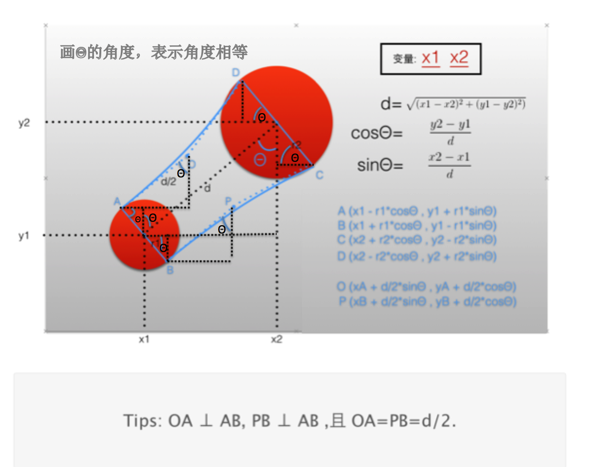

# iOS 基础知识


## iOS 模式
#### 单例模式
- **定义通用单例宏** 代码如下

```objc
//
//  QJOneModel(单例模式).h
//  模式Dome
//
//  Created by 瞿杰 on 2019/9/28.
//  Copyright © 2019 yiniu. All rights reserved.
//  实现所有对象在ARC 或 MRC 环境下 通用单例宏:
//  1、在 .h 文件中调用 DISPATCH_ONE_H(FunctionName) 宏 ，用的时候 [selfClass shareFunctionName];
//  2、在 .m 文件中调用 DISPATCH_ONE_M(FunctionName) 宏 ，注意 FunctionName 这个参数与上面的宏参数一致

// .h文件中调用这个宏
#define DISPATCH_ONE_H(FunctionName)                            \
+(instancetype)share##FunctionName;                             \

// ARC 环境
#if __has_feature(objc_arc)
// .m文件中调用这个宏
#define DISPATCH_ONE_M(FunctionName)                            \
static id _instance = nil;                                      \
+(instancetype)allocWithZone:(struct _NSZone *)zone             \
{                                                               \
    static dispatch_once_t onceToken;                           \
    dispatch_once(&onceToken, ^{                                \
    _instance = [super allocWithZone:zone];                     \
    });                                                         \
    return _instance;                                           \
}                                                               \
+(instancetype)share##FunctionName                              \
{                                                               \
    return [[self alloc] init];                                 \
}                                                               \
                                                                \
-(id)copy                                                       \
{                                                               \
    return _instance;                                           \
}                                                               \
-(id)mutableCopy                                                \
{                                                               \
    return _instance;                                           \
}

// MRC 环境
#else

#define DISPATCH_ONE_M(functionName)                            \
static id _instance = nil;                                      \
+(instancetype)allocWithZone:(struct _NSZone *)zone             \
{                                                               \
    static dispatch_once_t onceToken;                           \
    dispatch_once(&onceToken, ^{                                \
    _instance = [super allocWithZone:zone];                     \
    });                                                         \
    return _instance;                                           \
}                                                               \
+(instancetype)share##functionName                              \
{                                                               \
    return [[self alloc] init];                                 \
}                                                               \
                                                                \
-(id)copy                                                       \
{                                                               \
    return _instance;                                           \
}                                                               \
-(id)mutableCopy                                                \
{                                                               \
    return _instance;                                           \
}                                                               \
-(oneway void)release                                           \
{                                                               \
}                                                               \
-(instancetype)retain                                           \
{                                                               \
    return _instance;                                           \
}                                                               \
-(NSUInteger)retainCount                                        \
{                                                               \
    return MAXFLOAT;                                            \
}

#endif


```


---


##  一、APP启动过程
- **1.加载每个.m文件的 +(void)load 方法**
- **2.找到main.m文件，执行UIApplicationMain,然后创建UIApplication应用程序 和 AppDelegate 对象**
- **3.创建一个主线程事件循环**
- **4.加载应用配制文件 info.plist ， 找到 Main**
- **5.然后加载 Main.storyboard **
**- 6.然后创建一个UIWindow,再找到里面箭头指向的ViewController,并添加到window上显示管理软件页面**
- **7.当程序启动后，通知 AppDelegate对象 程序加载完成application:didFinishLaunchingWithOptions: 。**


##### 3. 在编译文件时 系统会自动在每一个文件中定义一个宏 __OBJC__
```OBJC
#define __OBJC__
```

#### 4. 宏 与 const 区别

- const 修饰那部分的变量只能读

```objc
int const *p = &b ;     //  *p:只能读 ，  p:可读可写
int * const p = &b ;    //  *p:可读可写 ，p:只能读
const int * const p = &b;// *p:只能读 ， p:只能读
int const * const p = b&;// *p:只能读 ， p:只能读
```


#### 5. 设置app icon 上的提示数字
```OBJC
    UIApplication * app = [UIApplication sharedApplication];

    // 在设置 app icon 上的提示数据时， 先必须注册一下用户通知
    UIUserNotificationSettings * settings = [UIUserNotificationSettings settingsForTypes:UIUserNotificationTypeBadge categories:nil];
    [app registerUserNotificationSettings:settings];

    app.applicationIconBadgeNumber = 10;
```
#### 6. 系统默认把状态栏 status bar 交给 view controller 来管理，改变这种管理对象（把 status bar 交给 UIApplication 来管理）
 - 在项目中 ifno.plist 中添加一个配制等于 NO

 


## 二、读写数据到本地
### 1.读写plist文件
- 1> NSArray 或  NSDictionary 转成 .plist 文件
```objc
    NSArray<NSDictionary *> * persons = @[
                                        @{
                                          @"name":@"qj",
                                          @"age" :@18,
                                          @"high":@180
                                          },
                                          @{                                                        @"name":@"qj2",
                                              @"age" :@18,
                                              @"high":@180
                                              }
                                        .........
                                        ];

    // 写入到plist文件中
    NSString * path = [[NSBundle mainBundle] pathForResource:@"persons" ofType:@"plist"];
   BOOL flag = [persons writeToFile:path atomically:YES];
   if(flag){
    NSLog(@"%@",@"已经写入plist文件")
   }
```

- 把 plist 中数据转成NSArray 或 NSDictionary

```objc
NSString * path = [[NSBundle mainBundle] pathForResource:@"persons" ofType:@"plist"];

NSArray<NSDictionary *> * persons = [NSArray arrayWithContentsOfFile:path];
NSLog(@"%@",persons);

```

- **NSCache 类**
    - 介绍
        - NSCache 的 Key 只是**对 objc 做强引用，而不是拷贝**; **类似于NSDictionary用法**，但不需像 NSDictionary 实现 NSCopying 协议，**NSDictionary 是对 value 进行拷贝存储**

        - NSCache 在系统内存很低时，会自动释放一些对象
        - **备注**：这句话源自苹果的官方文档，不过在模拟器中模拟内存警告时，缓存不会做清理动作 为了确保接收到内存警告时能够真正释放内存，**最好调用一下 removeAllObjects 方法**

        - **NSCache 是线程安全的**，在多线程读写数据操作中，**不需要对 Cache 加锁**

    - 属性 与 方法
    ```objc
        // 代理，当 objc 被删除时调用代理方式
        @property (nullable, assign) id<NSCacheDelegate> delegate;

        // 取数据
        - (nullable ObjectType)objectForKey:(KeyType)key;

        // 写数据
        - (void)setObject:(ObjectType)obj forKey:(KeyType)key; // 0 cost
        // cost 花费：第一个对象自己给定一个消耗值，该方法与totalCostLimit 配合使用
        - (void)setObject:(ObjectType)obj forKey:(KeyType)key cost:(NSUInteger)g;

        // 删除所有存入的对象
        - (void)removeAllObjects;

        // 总花费，当写入的对象 花费总和 > totalCostLimit 时，会自动删除最先写入的对象
        @property NSUInteger totalCostLimit ;	// limits are imprecise/not strict
        @property NSUInteger countLimit;	// limits are imprecise/not strict
        @property BOOL evictsObjectsWithDiscardedContent;
    ```


- 类在创建对象时调用 alloc ，其里面是调用了 +(instancetype)allocWithZone:(struct _NSZone *)zone 方法创建对象


###2. 沙盒存取
 - **应用沙盒结构**
    - **沙盒根目录 ：NSHomeDirectory()**
        - **Documents** : 保存应用运行时所生成的**需要持久化数据**，iTunes 同步设备时会**同备份步该目录数据**；
        ```objc
        NSString * documentPath = [NSHomeDirectory() stringByAppendingPathComponent:@"Document"];
        ```

        - **tem** :保存应用运行时所需的 **临时数据**，使用完毕后再将相应的数据文件从该目录下删除，应用没有运行时，系统也**可能**会清除该目录下的文件，iTunes **不会同步备份该目录**；
        ```objc
        NSTemporaryDirectory()
        ```

        - **Library/Caches** : 保存应用运行时生成的**需要持久化数据**，iTunes 同步设备时**不会同步备份该目录**，一般存储大体积，不需要备份的非重要数据；
        ```objc
            // 获取 caches 目录的路径
            NSString * cachesPath =  NSSearchPathForDirectoriesInDomains(NSCachesDirectory, NSUserDomainMask, YES);
        ```

        - **Library/Preferences** : 保存应用的**偏好设置**，iOS 的 settings 设置应用会在该目录下查找应用的设置信息。iTunes 在同步设置时 **会同步备份**该目录
        ```objc
        // 1. 存储到 Library/Preferetce , 存储时是以字典存的
        NSUserDefaults * userDefaults = [NSUserDefaults standardUserDefaults];
        [userDefaults setObject:@"qujie" forKey:@"name"];
        [userDefaults setInteger:19 forKey:@"age"];
        // 同步一下
        [userDefaults synchronize];

        // 2. 读取数据
        NSString * name = [userDefaults objectForKey:@"name"];
        NSInteger age = [userDefaults integerForKey:@"age"];
        NSLog(@"name = %@ , age = %ld",name , age);
        ```

 - **归档 NSKeyedArchiver 和 解档 NSKeyedUnarchiver**
    - 1.把某个模型归档，就先遵守 NSCoding 协议
    - 2.在模型中 实现 NSCoding 协议中的两个方法
    - 3.使用 NSKeyedArchiver 归档对象 和 NSKeyedUnarchiver 解档对象

```objc
// 狗类型,要归档和解档的对象类型
@interface Dog : NSObject<NSCoding>
@property (nonatomic , copy) NSString * dogName ;
@property (nonatomic , assign) NSInteger dogAge ;
@end
@implementation Dog
// 归档所需的方法
-(void)encodeWithCoder:(NSCoder *)aCoder
{
    if (self.dogName) {
        [aCoder encodeObject:self.dogName forKey:@"dogName"];
    }
    [aCoder encodeInteger:self.dogAge forKey:@"dogAge"];
}
// 解档所需的方法
-(instancetype)initWithCoder:(NSCoder *)aDecoder
{
    if (self = [super init]) {
        self.dogName = [aDecoder decodeObjectForKey:@"dogName"];
        self.dogAge = [aDecoder decodeIntegerForKey:@"dogAge"];
    }
    return self;
}
-(NSString *)description
{
    return [NSString stringWithFormat:@"dogName = %@ , dogAge = %ld",self.dogName , self.dogAge];
}
@end

// 人类型,要归档和解档的对象类型
@interface Person : NSObject<NSCoding>
@property (nonatomic , copy) NSString * name ;
@property (nonatomic , assign) NSInteger age ;
@property (nonatomic , strong) Dog * dog ;
@end
@implementation Person
// 归档所需的方法
-(void)encodeWithCoder:(NSCoder *)aCoder
{
    if (self.name) {
        [aCoder encodeObject:self.name forKey:@"name"];
    }
    [aCoder encodeInteger:self.age forKey:@"age"];
    // 执行这行代码时，会自动调用 Dog 对象的 encodeWithCoder: 方法
    [aCoder encodeObject:self.dog forKey:@"dog"];
}
// 解档所需的方法
-(instancetype)initWithCoder:(NSCoder *)aDecoder
{
    if (self = [super init]) {
        self.name = [aDecoder decodeObjectForKey:@"name"];
        self.age = [aDecoder decodeIntegerForKey:@"age"];
        // 执行这行代码时，会自动调用 Dog 对象的 initWithCoder: 方法
        self.dog = [aDecoder decodeObjectForKey:@"dog"];
    }
    return self;
}
-(NSString *)description{
    return [NSString stringWithFormat:@"name = %@ , age = %ld , dog = %@",self.name , self.age , self.dog];
}
@end


@interface ArchivingViewController ()

@end

@implementation ArchivingViewController

- (void)viewDidLoad {
    [super viewDidLoad];
    // Do any additional setup after loading the view.

    UIButton * buttonSave = [UIButton buttonWithType:UIButtonTypeSystem];
    [buttonSave setTitle:@"save" forState:UIControlStateNormal];
    [buttonSave addTarget:self action:@selector(save) forControlEvents:UIControlEventTouchUpInside];
    buttonSave.frame = CGRectMake(100, 300, 60, 40);
    [self.view addSubview:buttonSave];

    UIButton * buttonRead = [UIButton buttonWithType:UIButtonTypeSystem];
    [buttonRead setTitle:@"read" forState:UIControlStateNormal];
    [buttonRead addTarget:self action:@selector(read) forControlEvents:UIControlEventTouchUpInside];
    buttonRead.frame = CGRectMake(200, 300, 60, 40);
    [self.view addSubview:buttonRead];
}

-(void)save
{
    Person * person = [[Person alloc] init];
    person.name = @"qujie";
    person.age  = 19 ;
    person.dog = [[Dog alloc] init];
    person.dog.dogName = @"xiao huang";
    person.dog.dogAge = 2 ;

    // 归档 NSKeyedArchiver
    NSString * path = [NSTemporaryDirectory() stringByAppendingPathComponent:@"Person.data"];
    [NSKeyedArchiver archiveRootObject:person toFile:path];
}
-(void)read
{
    // 解档 NSKeyedUnarchiver
    NSString * path = [NSTemporaryDirectory() stringByAppendingPathComponent:@"Person.data"];

    Person * person = [NSKeyedUnarchiver unarchiveObjectWithFile:path];

    NSLog(@"%@",person);
}
@end
```


### 3. XIB两种加载方式
```objc
    // 第一种方式
    NSArray * views = [[NSBundle mainBundle] loadNibName:@"xib名称" owner:nil options:nil];

    //第二种方式
    UINib * nib = [UINib nibWithNibName:@"xib名称" bundle:nil]; // nil 表示当前项目路径
    NSArray * views = [nib instantiateWithOwner:nil options:nil];
```

### 4. UIViewController 的xib 加载就只需要调用 init
- 因为 init 方法是先去找对应的 控制器名称.storyboard 或者 .xib , 然后调用 【- initWithNibName:xxx bundle:(nullable NSBundle *)】加载
- 如果没有找到对应的 storyboard 或者 xib 就会创建一个控制器

- 控制器中的 view 是通过懒加载的方式创建，会调用 - loadView （在该方法中可以自定义一个view）
- 当果调用 UIViewController 的 -loadViewIfNeeded 后，在还没有加载控制器的view时就会自动去加载view然后赋值给控制器。

### 5 UIWindow 成为主窗口
- 创建 UIWindow
- 设置根控制器 rootViewController
- 设置当前创建的 UIWindow 成为主窗口 -makeKeyAndVisible。
    - 把当前window 赋值给 [UIApplication sharedApplication].keyWindow 对象。
    - 加载控制器的 view 并添加到 window 上。


## 三、Foundation 框架
### 1. 描述这个被废弃的方法或都是属性
```objc
NS_DEPRECATED_IOS(6_0, 9_0, "描述这个被废弃的方法或都是属性，指向被什么替代")
```

### 2. NSString 对象计算真实的Size
```objc
[@"我是要被计算真实大小的字符串" boundingRectWithSize:CGSizeMake(CGFLOAT_MAX, CGFLOAT_MAX) options:NSStringDrawingUsesLineFragmentOrigin attributes:@{NSFontAttributeName:[UIFont systemFontOfSize:18]} context:nil];
```

### 3. automatic layout 自动布局实质是 设置frame
 - automatic layout 设置的布局在view 调用 layoutSubviews 方法后系统会自动转化成 frame

### 4. 在自动布局调用 layoutIfNeeded 的作用
 - 自动布局最终的
 - 问题：怎样在使用了自动布局后取到对应的frame
```objc
// 前提1：当view中的子控件使用了自动布局
// 当view 调用了[view layoutIfNeeded]后，系统会自动去调用[view layoutSubviews],然后计算view中子控件的frame
[self.view layoutIfNeeded];
// 然后就可以取到view中子控件的frame(除了UILabel对象特别一些)
```
```objc
// 需要设置UILabel对象的最大 MaxWidth 方法
UILabel * autLayoutLabel = [[UILabel alloc]init];
autLayoutLabel.text = @".....";
// 设置 autLayoutLabel 对象文字内容最大的显示宽度
autLayoutLabel.preferredMaxLayoutWidth = 100 ;
// 最后再取 autLayoutLabel.frame 位置
```

### 5. KVO 知识点
```objc
    // 1.当tableView调用了这个方法让 self 对象去监听属性后，系统会自动创建一个 NSKVONotifying_UITableView的类型
    // 2. 重定监听的属性 setter 方法，然后去实现KVO
    [self.tableView  addObserver:self forKeyPath:@"contentOffset" options:NSKeyValueChangeNewKey context:nil];

    NSLog(@“真实类型isa = %@”,self.tableView);

    // 2.实现KVO监听
    -(void)observeValueForKeyPath:(NSString *)keyPath ofObject:(id)object change:(NSDictionary<NSKeyValueChangeKey,id> *)change context:(void *)context
{
    NSLog(@"key = %@ , obj = %@ , change = %@",keyPath,object,change);
}


    // 3. 移除KVO
    [self.tableView removeObserver:self forKeyPath:@"contentOffset"];
```
### 6. KVC
```objc
    // 1. 取出字典里面的每对 key 和 value
    // 2. 然后再找 objct 中对应的成员变量然后赋值 setValue: forKey:
    //   2.1 如果没有找到该成员变量setter 方法名，就会去找 下划线成员变量；
    //   2.2 如果找不到下划线成员变量，就会去找 同名的成员变量
    //   2.3 再果还是找不到的话就直接抛出异常。
    [objct setValuesForKeysWithDictionary:dic];


    // 找 objct 中对应的成员变量（找不到就层层递归）然后赋值 setValue: forKey:
    [objct setValue:value forKeyPath:key];

```

### 7. 判断一个对象是否实现了某个方法
```objc
    [self respondsToSelector:@selector(xxxxx)]
```
### 8. 自定义QJLog(...)
```objc
// 放在 PCH 文件中
#define QJLog(...)  NSLog(__VA_ARGS__)
```

### 9. block
- block是一个对象，可以添加到数组或字典中

- block 内存管理
    - **注意**：block 是对外部**对象值的地址引用，不是对象名内存地址的引用**，如果对象**加了__block 声明后就是对 对象名内存地址的引用**，对象名内存中存放的地址改变则block内部引用跟着变。
        - 如果 引用的对象用 **static** 修饰,则与使用**__block效果一样**，对象名地址传递

    ```objc
    NSMutableArray * arr = [NSMutableArray arrayWithObjects:@1,@2,@3, nil];
//    __block NSNumber * num = @14;
    self.block = ^{
//        NSLog(@"%p === %@",num,num);
        NSLog(@"arr = %@ , count = %ld",arr,arr.count);
    };
    self.block();
//    num = @10;
//    [arr removeLastObject];
    arr = [NSMutableArray arrayWithObjects:@4,@5,@6, nil];
    self.block(); // block内部得到的是 arr 原先指向的对象
    ```

    - 验证方式：打印block对象，可以看到不同的结果
    - MRC 手动管理内存
        - **全局区**： 只要block内部代码**没有引用局部变量**，block就**放在全局区**
        - **栈区**：只要block内部代码**引用局部变量**，block就**放在栈区**
        - **堆区**：属性使用copy放在堆区中(引用了局部变量放在堆中，如果未引用则放在全局区),不使用retain(因为引用了局部变量时block放在栈区会被释放掉造成野指针)

    - ARC 自动管理内存
        - 前两点与MRC一样
        - **strong 与 copy 一样，内部未引用局部变量时放在全局区，引用了局部变量时放在堆中**

- block的循环引用解决方法
```objc
 __weak typeof(self) weakSelf = self ;

 // 或者
 __unsafe_unretained typeof(self) weakSelf = self ;
```

- block 的定义方式
```objc
    // 第一种:没有返回值，也没有参数
    void (^block1)() = ^{
    };

    // 第二种:没有返回值，有参数
    void (^block2)(int) = ^(int a){
    };

    // 第三种:有返回值，没参数
    int (^block3)() = ^{
        return 3;
    };
    int (^block3)() = ^int{
        return 3;
    };

    // 第四种：有返回值，有参数
    int (^block4)(int) = ^int(int a){
        return a ;
    };
    int (^block4)(int) = ^(int a){
        return a ;
    };
```


#
### 10. 多线程

- **一个应用至少有一个或多个进程，且一个进程中至少有一个或多个线程**
- **进程是CPU分配资源和调度的单位**
- **线程是CPU调用(执行任务)的最小单位**
- **CPU分配给进程的资源，在当前进程内的多个线程是共享进程中的资源**

#### 进程
- 一个程序至少有一个进程
- 一个进程中至少有一个或多个线程
- 进程是CPU分配资源和调度的单位
- 每个**进程之间是独立的，每个进程均运行在其专用且受保护的内存空间内**

- **线程**
    - 线程是添加到线程池中被调度执行(同步 或 异步)任务
    - 一个进程必须依靠线程来执行任务
    - 线程中的多个任务是串行执行的，即在一个线程内同一时间只能执行一个任务

    - 主线程：用来处理UI 和 UI相关事件
    - 子线程：即非主线程 或 后台线程，用来处理比较耗时的任务
    - 当线程空闲后，发果后面还有任务，又重新被利用起来

- **多线程**
    - 单个CPU内调度的一个进程中有多个线程，每条线程可以并行（“同时”：虽然在同一时间只能执行一个线程，但可以在多个线程之间来回切换执行）执行不同的任务 ， 可以有效提高效率。

    - 如果有多个CPU，那么就可以达到同一时间并发执行多个线程，

    - **优点与缺点**
        - 优点：
            - 能适当的提高资源利用率高
            - 能适当的提高程序的执行效率

        - 缺点：
            - 创建的多个线程占用内存
            - 创建太多的线程，会降低程序的性能
            - 线程越多，CPU调度开销越大
            - 程序设计的更复杂；比如线程之间的通信、多线程的数据共享

    - 多线程管理情况：GCD，NSOperation 等
    

    - **线程的生命周期中的多种状态**
        - **start 启动**：线程开启执行任务，**把当前线程添加到可调度的线程池中，进入就绪状态**;

        - **Running 运行**：CPU切换调度线程池中的线程来执行任务；

        - **sleep 阻塞**：调用了 sleep方法 或 同等同步锁，这一步会将**当前线程挂起（即 移出可调度的线程池，但还是存在内存中，等待下次被唤醒）**；

        - **被唤醒**：sleep 时间已经过了 或 锁被打开，这时**当前线程重新添加到可被CPU调度的线程池中**；

        - **exit 线程死亡**：也就是任务完成后、被强制结束exit 或 出现异常时，当前线程就会从内存中被移除销毁，**线程死亡是不可以再复用的，不然再用死亡线程执行任务会使程序崩溃**。

        

    - **线程的安全性**

        - **互斥锁**
            - **线程同步**：多线程在同一条线上按顺序地执行任务

            - **加锁方式**：
            ```objc
            // 锁：必须是唯一的全局变量,objc 是被加锁的对象
            // 1. 注意加锁的前提条件，多线程共享一块资源
            // 2. 加锁是需要耗性能
            // 3. 加锁的结果，多个线程是同步的，只有加锁的对象在加锁的代码块中用完后才被解锁，然后才轮到下一下线程用
            @synchronized (objc) {
                // 需要锁定的代码，这块代码是多个线程执行同一块代码

                // 注意：代码块执行完后，objc 对会被解锁
            }
            ```

            - **优点**：可以有效的防止多个线程资源抢夺造成的数据安全问题
            - **缺点**：需要不断的加锁 和 解锁，消耗大量的CPU资源

        - **nonatomic 非原子 和 atomic 原子 属性**
            - **atomic** ：
                - 原子属性，**为 setter 方法加锁**（OC属性默认为 atomic）
                - **线程安全**，需要消耗CPU资源

            - **nonatomic** :
                - 非原子属性，**不会为 setter 加锁**
                - **非线程安全**，适合内存小的移动设备

    - **线程间通信**
        - 线程A 执行任务得到的一个结果Q，然后把结果Q传给 线程B，通知线程B 去做任务（经典通信就是：网络下载 然后把数据显示到UI上）
        
        ```objc
        dispatch_queue_t queue = dispatch_queue_create("xxxQueue", DISPATCH_QUEUE_CONCURRENT);
        dispatch_sync(queue, ^{
            NSLog(@"%@====",[NSThread currentThread]);
            dispatch_async(dispatch_get_main_queue(), ^{
               // UI 在主线程操作,实现通讯
            });
        });
        ```

        - GCD 可以使用栅栏 或 组队列通知
        - NSOperation 可以使用 任务的依赖关系(不同队列内的任务是可以相互依赖，但不能形成循环依赖)

    - **GCD**
        - 纯C语言，提够了许多非常强大的函数，可以说是中枢调度器
        - **GCD 的优势**
            - CGD 是苹果公司为 **多核** 的 **并行** 运算提够解决方案
            - **GCD 会自动充分利用多核 同时进行处理任务**
            - **CGD会自动管理线程的生命周期**（线程的创建、调度、销毁）

        - 队列 和 任务
            - 第一步：定制任务（即代码块）
            - 第二步：**GCD会自动将任务添加到队列中**
                - CGD 在执行队列中的任务时，按照**先进先取的原则执行**

        - **当前线程 执行任务的 方式**
            - **同步** 执行任务
                - 只能在**当前线程**中执行任务，**不具备开启新线程的能力**

                - 当前线程 只有把 同步任务 执行完后，才能执行下一个任务，不然就一直等队列把当前同步任务再次给当前线程执行完，当前线程才接着执行下一个任务
            ```objc
            dispatch_sync(dispatch_queue_t  _Nonnull queue, ^{
                // 同步执行的任务
            })
            ```
            - **异步** 执行任务
                - 可以在**新的线程**中执行任务，**具备**开启新线程的能力

                - 当前线程不用等异步任务执行，就可以执行下一条任务
            ```objc
            dispatch_async(dispatch_queue_t  _Nonnull queue, ^{
                // 异步执行的任务
            })
            ```

            - **队列类型**
                - 队列中的(同步 或 异步)任务 是在 当前线程中执行；除了主队列中的任务 只给主线程执行
                - 创建队列
                ```objc
                // 参数1：队列的标识名 "xxxQueue"
                // 参数2：队列类型，串行 和 并发队列
                dispatch_queue_create(const char * _Nullable UILabel, dispatch_queue_attr_t  _Nullable attr)
                ```

                - **串行队列**
                    - 表示：
                    ```objc
                    // 串行队列
                    DISPATCH_QUEUE_SERIAL
                    ```

                    - 让队列中的任务按串行的方式一个一个执行任务
                    - **注意**：就算是**异步的任务**，也是一个一个执行任务，但**会开启一个子线程**

                - **主队列**
                    - **注意**：**主队列中的任务 只 放在主线程中执行**；且 主队列 检查到 主线程正在执行任务，那么就会暂停调度下一个任务，直到主线程没有在执行任务，才继续调度主队列中的(同步 或异步)任务 给 主线程执行

                - **并发队列**
                    - 表示 **线程间的并发**；而**不是 任务间的并发**；同步、异步任务是在队列的调度下，把任务给某个线程执行
                    ```objc
                    // 第1种：并行队列
                    DISPATCH_QUEUE_CONCURRENT

                    // 第2种：获取全局并发队列
                    // identifier：优先级，DISPATCH_QUEUE_PRIORITY_HIGH = 2、DEFAULT = 0、LOW = -2 和 BACKGROUND = 16位整数的最小值
                    // flags :  总是 = 0 ，用于将来被使用
                    dispatch_get_global_queue(long , unsigned long flags)
                    ```

                    - 可以让多个任务并发（同时）执行，会自动开启多个线程同时执行任务
                    - **注意**：**并发功能** 只能**在并发队列 且是在 异步(dispatch_async)**函数下**才有效**

            - **同步、异步函数 与 串行、并发队列 的关系**
                - **(1) 异步函数 + 并发队列**：**开启多条子线程**(子线程个数=不确定个数)，任**务在对应的子线程按并发**执行的

                - **(2) 异步函数 + 串行队列**：**只开启一条新的子线程**，任务在子线程按串行执行的
                    - **特别注意**
                        - **异步函数 + 主队列：不会开启一条新的子线程，任务在主线程按串行执行**

                - **(3) 同步函数 + 并发队列**：**不会开启新的子线程**，任务只在当前线程中 按**串行**执行任务

                - **(4) 同步函数 + 串行队列**：不会开启新的子线程，任务按串行执行的
                    - **特别注意**
                        - **在主线程(main thread)中，如果在主队列(dispatch_get_main_queue() ) 中执行 同步的任务，那么会产生死锁，卡死主线程**
                            - **解释**：主队列的特点 就是 如果**主队列发现主线程有任务在执行时**，那么**主队列会暂停调用队列中的任务**，**等主线程没有在执行任务时再调度**主队列中的任务，**但是 主线程还在工作**，一直要执行刚刚的block , **所以等待形成了死循环，也就是死锁**
                            ```objc
                            // 当前线程是在主线程中，主线程中的少部分任务 被添加到 主队列中
                            dispatch_queue_t queue = dispatch_get_main_queue();
                            // 1.主线程还要执行 block 任务；
                            // 2.但block 任务被添加到主队列中去了;
                            // 3.主队列检查到主线程还在任执行任务，以所先不急着调 block 任务 给 主线程执行；
                            // 4.但 主线程必须执行完 block 才空闲，所以在等 主队列调度 block 任务给自己(执行完这个block 就可以闲下来了);
                            // 5.最后结果：主队列 等 主线程，主线程 等 主队列，形成死锁！！！
                            dispatch_sync(queue, ^{
                                NSLog(@"%@====",[NSThread currentThread]);
                            });
                            ```

                            - **如果不在 主线程中 执行上面的代码，那么就不会形成死锁**

                - **GCD常用函数**
                    - 单例(one) 函数：内部是加锁的
                        - 在 **非主队列**中的**同步方式(dispatch_sync)**在当前线程执行任务
                        ```objc
                        static dispatch_once_t onceToken;
                        // 内部是 在 非主队列中的同步(dispatch_sync)执行任务
                        dispatch_once(&onceToken, ^{
                            NSLog(@"只执行一次 ， 在当前线程 =  %@",[NSThread currentThread]);
                        });
                        ```

                    - 延迟(after) 函数
                        - 按 **异步方式(dispatch_async)** 执行任务
                        ```objc
                        dispatch_queue_t queue = dispatch_queue_create("xxxx", DISPATCH_QUEUE_CONCURRENT);
                        // 异步(dispatch_async) 方式执行任务
                        dispatch_after(dispatch_time(DISPATCH_TIME_NOW, (int64_t)(2.0 * NSEC_PER_SEC)), queue, ^{
                            // queue = main queue , block任务 就是在 主线程 中执行
                            // queue = 串行队列(DISPATCH_QUEUE_SERIAL) , 只开启一个新的子线程， block任务 就是在 新的子线程 中执行
                            // queue = 并发队列(DISPATCH_QUEUE_CONCURRENT) ,开启多条新的子线程，block任务 就是在 新的子线程 中执行
                            NSLog(@"1.当前线程 = %@",[NSThread currentThread]);
                        });
                        ```

                        - 栅栏(barrier) 函数
                            - **拦截 或 控制** 队列中的 **栅栏前任务组** 和 **栅栏后任务组** 的 **执行顺序**，前任务组必须完全执行完后，才能接着执行后面的任务组

                            - **注意**：栅栏 在 全局并发队列中无法 控制前后任务组的 执行先后顺序
                            ```objc
                            dispatch_queue_t queue = dispatch_queue_create("xxxQueue", DISPATCH_QUEUE_CONCURRENT);

                            // 栅栏前添加到队列的 任务

                            // 栅栏: 拦截 或 控制 队列中的 栅栏前任务组 和 栅栏后任务组 的 执行顺序
                            dispatch_barrier_sync(queue, ^{
                                NSLog(@"%@====栅栏 任务",[NSThread currentThread]);
                            });

                            // 栅栏后添加到队列的 任务
                            ```

                        - 迭代(apply) 函数
                            - **循环执行 block 任务**；传的 次数 决定重复多少次，队列 决定是否并发，苹果建议使用 DISPATCH_APPLY_AUTO ，并发执行的任务 **比 for 循环要效率快**

                            - 任务的异步与同步性，取决 并发队列与串行队列
                            ```objc
                            // 迭代
                            // 参数1 iterations ： 迭代次数
                            // 参数2 queue      : 将任务放入队列  ，传入并发队列才有意，效率高 ，不然与 for 无差别
                            // 参数3 block      : 被线程执行的任务 , 如果加入到 并发队列就会是异步任务 ；如果加入到 串行队列就会是同步任务
                            dispatch_apply(10, dispatch_queue_create(0, DISPATCH_QUEUE_CONCURRENT), ^(size_t index) {
                                NSLog(@"indx = %ld , thread = %@",index,[NSThread currentThread]);
                            });
                            ```

                        - 组队列(group) 与 组通知(notify) 组合使用
                            - 给合使用后 ，当组队列 中的 queue 内所有任务执行完后，就会调用 组通知
                            ```objc
                            dispatch_queue_t queue = dispatch_get_global_queue(0, 0);
                            dispatch_group_t group = dispatch_group_create();
                            dispatch_group_async(group, queue, ^{
                                // queue 队列 中的 异步任务
                                NSLog(@"1== %@",[NSThread currentThread]);
                            });

                            // 通知队列组 中的 queue 队列 的任务已经完全执行完
                            dispatch_group_notify(group, queue, ^{
                            // 当前线程 是最后一个执行完任务的线程
                            NSLog(@"group 的 queue 队列 中的任务已经完成执行 === %@",[NSThread currentThread]);
                        });

                            // DISPATCH_TIME_FOREVER 永远等待
                            // 只有把 group 中所有队列的任务执行完才，执行接下来 founction 方法剩于代码，但剩于代码还是在 通知(notify) 函数 之前执行
                            dispatch_group_wait(group, DISPATCH_TIME_FOREVER);
                            NSLog(@"founction 完结=======");
                            ```

                - **(5)总结**
                    - **主队列** 中的**任务**(同步或异步) 都是放**在主线程中串行执行**(主线程正在执行某一个任务时，**必须等到任务执行完毕后才会执行下一个任务**)

                    - **串行队列** 中的任务都是一个一个**串行执行任务(不管是 同步或异步 任务)**

                    - **并发队列**(指的是线程间的并发，而不是任务间的并发) **决定开一条或多条线程**，**异步、同步函数决定是否开新的线程**

                
               - 执行任务大概的整体流程图
               

- **RunLoop 运行循环**
    - **1. 基本作用**
        - 保持程序(进程)的**持续运行,内部做了 do{...}while(判断runloop是否结束 或 退出)**
        - **监听处理App中各种事件**(如 触摸事件、定时器事件、selector 等)
        - 节省CPU资源，**提高程序性能**；即该做事时就启动，该休息时就停止
    

    - **2. RunLoop 与 线程 关系**
        - (1) 每一条线程都有一个**唯一与之对应**的 RunLoop，当子线程添加了RunLoop时，该子线程可以一直存在

        - (2) 主线程的 RunLoop 系统自动创建好了，**子线程的 RunLoop 需要主动创建**
            - main.m 文件中的 main 方法 就有一个RunLoop 使得主线程不会退出，main 方法一直没有执行完直到程序结束 或 退出

        - (3) RunLoop 在第一次**获取时创建**(先查看当前线程有没有已经存在对应的RunLoop, 如果没有就创建新的，如果有就直接返回)，**在线程结束时销毁**
            - 获取 RunLoop时 内部存了一个字典，线程当成key，创建的RunLoop对象当成value值存取

            - **得到的 runLoop 需要运行**
                - **runLoop 内部必须至少要添加一个 timer sources 或 事件源(CFRunLoopSourceRef)**，否则在内部探查Mode 没有 timer sources 或 事件源时 会自动结束 runLoop !

            ```objc
            // 获取当前线程的 runLoop ，如果当前子线程没有runLoop,就创建当前线程对应的 runLoop
            // run : 运行 runLoop
            // 参数1 ：runLoop 运行模式
            // 参数2 ：在设定的时间结束 runLoop 循环
            [[NSRunLoop currentRunLoop] runMode:UITrackingRunLoopMode beforeDate:[NSDate date]];

            // 如果 runLoop 真的运行了，那么在 run 方法后面的代码直到 runLoop 退出时才执行
            ```

    - **3. RunLoop 对象引用**
        - **CFRunLoopRef**
            - 获取时创建
            ```objc
            // 获取当前线程的 runLoop，没有就创建
            CFRunLoopRef runLoop = CFRunLoopGetCurrent();
            // 获取主线程的 RunLoop
            CFRunLoopRef mainLoop = CFRunLoopGetMain();
            ```

            - **NSRunLoop 是基于 CFRunLoopRef 封装的**
                - 获取
                ```objc
                [NSRunLoop currentRunLoop];
                [NSRunLoop mainRunLoop];
                ```

                - 转换成 CFRunLoopRef
                ```objc
                // 将 NSRunLoop 转成 CFRunLoopRef
                CFRunLoopRef curRunLoop = [NSRunLoop currentRunLoop].getCFRunLoop;
                ```

    - **4. RunLoop内所需的相关类型对象**
        - ***注意***：**在 runLoop 中有多个运行模式**，但在**同一时间** RunLoop **只能选择一种模式运行**，**每种模式都是独立运行**
            - **每种 Mode模式 至少有一个 timer 或者 source**
        

            - **CFRunLoopRef 对象**
                - **RunLoop处理事件源的运行过程**
                

                    - **自动释放池 创建与销毁**
                        - 创建
                            - 第一次：**启动 runLoop 时**

                            - 其他时候：**runLoop 即将进入睡眠时**先销毁之前的释放池(将该释放池内的对象都销毁)，**再重新创建一个新的释放池**，这也是为了**节省资源**(睡眠自然要节省资源)
                        - 销毁
                            - 其他时候：**runLoop 即将进入睡眠时**先销毁之前的释放池(将该释放池内的对象都销毁)，这也是为了**节省资源**(睡眠自然要节省资源)

                            - 最后一次：**runLoop 退出时销毁**

                - **CFRunLoopMode 模式**
                    - 类型：CFString 类型的枚举

                    - **注意：Mode 内必须要有一个 timers源 或者 sources源**

                    - 相关常用模式
                        - **kCFRunLoopDefaultMode** : App默认的模式; 通常主线程是在这种模式下运行
                            - **kCFRunLoopDefaultMode == NSDefaultRunLoopMode**

                        - **UITrackingRunLoopMode** : 界面跟踪mode ; 当**ScrollView 追踪触摸滑动**时，自动切换到这种模式下工作，保证界面滑动时不受其他Mode 影响

                        - **kCFRunLoopCommonModes** : 这是一个占位用的 Mode ,不是一种真正的模式
                            - **kCFRunLoopCommonModes == kCFRunLoopDefaultMode + UITrackingRunLoopMode**
                    - **CFRunLoopSourceRef 触发事件来源**
                        - **事件源区分**
                            - **sources0** :非基于 Port， 用户主动触发事件，比如：点击按钮后触发该事件源，调用一系列函数
                            - **sources1** : 基于 Port，系统自动触发的事件

                        - **子线程长驻处理事件任务 示例**
                        ```objc
                        // sources 用法
                        if (self.subThread) {
                            // 长驻子线程 执行方法
                            [self performSelector:@selector(subThreadTask) onThread:self.subThread withObject:nil waitUntilDone:YES];
                            // waitUntilDone = YES : 表示当 subThreadTask 方法执行完后才执行下面代码
                            return ;
                        }
                        __weak typeof(self) weakSelf = self ;
                        dispatch_async(dispatch_queue_create("xxxxQueue", DISPATCH_QUEUE_SERIAL), ^{

                            NSLog(@"current thread = %@",[NSThread currentThread]);

                            // 当前线程
                            weakSelf.subThread = [NSThread currentThread];

                            // 1. 当前子线程长驻(添加 )
                            NSRunLoop * runLoop = [NSRunLoop currentRunLoop];

                            // 2. 添加 默认Mode 的 sources1 端口
                            NSPort * port = [NSPort port];
                            [runLoop addPort:port forMode:NSDefaultRunLoopMode];

                            // 3.添加 runLoop 通知(一定要在 运行前添加)
                            CFRunLoopObserverRef observer = CFRunLoopObserverCreateWithHandler(kCFAllocatorDefault, kCFRunLoopAllActivities, YES, 0, ^(CFRunLoopObserverRef observer, CFRunLoopActivity activity) {
                                // 当 runLoop退出时
                                if (activity == kCFRunLoopExit) {
                                    NSLog(@"当前线程的 runLoop 已经退出了");
                                    self.subThread = nil ;
                                }
                            });
                            CFRunLoopAddObserver(runLoop.getCFRunLoop, observer, kCFRunLoopDefaultMode);

                            // 3. 运行 runLoop , 5秒后就结束 runLoop （即5秒后当前线程就不能处理事件了，线程和runLoop结束）
                            [runLoop runUntilDate:[NSDate dateWithTimeIntervalSinceNow:5] ];

                        });
                        ```

                    - **CFRunLoopObserverRef 观察者**
                        - 能够**监听 RunLoop 的状态改变**

                        - 可以**监听的状态**
                        

                        - 示例
                        ```objc
                        // 如果是子线程，创建子线程的 runLoop , 如果当前线程是主线程，那么就是mainRunLoop
                        CFRunLoopRef runLoop = CFRunLoopGetCurrent();
                        CFRunLoopObserverRef observer = CFRunLoopObserverCreateWithHandler(kCFAllocatorDefault, kCFRunLoopAllActivities, YES, 0, ^(CFRunLoopObserverRef observer, CFRunLoopActivity activity) {
                            NSLog(@"RunLoop 当前的状态 = %ld",activity);
                        });
                        CFRunLoopAddObserver(runLoop, observer, kCFRunLoopCommonModes);
                        ```

                    - **CFRunLoopTimerRef    定时,如NSTimer**
                        ```objc
                        // 1、第一种 NSTmer
                        // timer 只有添加到 runLoop 才可以正常启动
                        NSTimer * timer = [NSTimer timerWithTimeInterval:1 repeats:YES block:^(NSTimer * _Nonnull timer) {
                            // 重复调用的 block
                        }];
                        [[NSRunLoop mainRunLoop] addTimer:timer forMode:NSRunLoopCommonModes];

                        // 2、第二种
                        // 创建子线程的 runLoop , 如果当前线程是主线程，那么就是mainRunLoop
                        CFRunLoopRef runLoop = CFRunLoopGetCurrent();
                        CFRunLoopTimerRef timer = CFRunLoopTimerCreateWithHandler(kCFAllocatorDefault, CFAbsoluteTimeGetCurrent(), 2, 0, 0 , ^(CFRunLoopTimerRef timer) {
            NSLog(@"runLoop timer thread = %@",[NSThread currentThread]);
        });
                        CFRunLoopAddTimer(runLoop, timer, kCFRunLoopCommonModes);
                        CFRunLoopRun();
                        ```

    - **RunLoop 的一些实现应用** ：https://www.jianshu.com/p/ac05ac8428ac


### 11 网络请求

##### URL
- 格试：http协议://服务器地址/绝对路径
    - URL常见协议
        - HTTP
            - **超文本传输协议(明文传输)**，访问的是远程的网络资源，格式是http://
            - http 协议是网络请求中最常用的协议

        - HTTPS
            - 实际是** HTTP+SSL(证时安全保护层) 组成的**
            - **对超文本进行加密(SSL层加密)后再传输协议**，比HTTP安全，多了一层SSL保护

        -  file
            - 访问的是本地计算机上的资源，格式是 file://(不用加主机地址)

        -  mailto
            -  访问的是电子邮件地址，格式是 mailo://

        -  FTP
            -  访问的是共享主机的文件资源，格试ftp://

- 发送HTTP请求的方式
    - **POST**
        - 发送给服务器的参数是放在请求体(HTTPBody)中

        - 理论上，POST传递的参数是没有限制的（具体还要看服务器处理能力）

        - 安全性高于GET，因为参数不是直接拼在URL后面，是看不到的

    - **GET**
        - 多个上传的参数是以&分隔开，比如 http://www.test.com/login?userName=111&pwd=123&type=JSON

        - URL 后面附带的参数是有限制的，通常不超过1KB

        - 请求的参数是直接放在URL后面的

- **HTTPS**
    - 简单说明
        - 组成部分：HTTP + SSL(对数据安全加密详情)
        - HTTPS 的安全基础是SSL层，因此加密的详情就需要SSL。SSL它是一个抽橡标识体系(URI scheme)
        - https：URL表明它使用了 HTTP ，但https存在不同于HTTP的默认端口及一个加密/身份验证层(该层位置HTTP层与TCP层之间)。

    - **HTTPS 与 HTTP 主要区别**
        - https 协议需要到car审请证书
        - http 是超文本传输协议，信息是明文传输；https 则是具有安全性的SSL加密传输协议
        - http 和 https 使用的是完全不同的连接方式，用的端口也是不一样，http是80端口，https是443端口
        - http 连接是很简单无状态的；https 协议是由SSL+HTTP协议构建的可进行加密传输、身份认证的网络协议，比http安全。

    - **https 加密传输流程图**
        - 说明
            - 1）客户端 向 服务端 发送一个https请求
            - 2）服务端先返回一个证书(即公钥)给客户端,如果客户端安装该证书则有下文，如果不安装则直接返回 error
            - 3）客户端根据公钥 随机产生一个对称值A，然对再对该对称A值进行SSL加密，得到一个对称密钥
            - 4）把对称密钥再发送给服务端，当服务端拿到后给客户端回应准备好接收
            - 5）通过客户端对明文进行对称密钥(或公钥)加密 得到密文，然后把密文传输给服务端
            - 6）服务端接收到密文后，通过密钥(或公钥)解密 得到原本的明文
            - 注意：经过几次步骤后，客户端与服务端都拿到了 公钥和密钥

        

        

    - **https 请求 代码实现**
        - **用 NSURLSession 实现**
            - 主要代码
            ```objc
            #pragma mark - NSURLSession 网络请求
            -(void)sessionDataTask
            {
                NSOperationQueue * queue = [[NSOperationQueue alloc] init];
                queue.maxConcurrentOperationCount = 1 ;

                // delegate : NSURLSessionDelegate 是一个父协议，还有很多协议遵守了该父协议，如 NSURLSessionDataDelegate
                // delegateQueue : 如果是非主队列，那就是在子线程调用 代理方法
                NSURLSession * session = [NSURLSession sessionWithConfiguration:[NSURLSessionConfiguration defaultSessionConfiguration] delegate:self delegateQueue:queue];
                // 创建 task
                NSURLRequest * request = [NSURLRequest requestWithURL:[NSURL URLWithString:@"https://github.com/AFNetworking/AFNetworking"]];

                // 大数据下载用 delegate 回调方法
                NSURLSessionDataTask * dataTask = [session dataTaskWithRequest:request];

                // 断续 task
                [dataTask resume];
            }
            #pragma mark - NSURLSessionDelegate
            /// 请求 https 时调用代理方法，询问收到服务器返回的证书处理方案（安装 or 不安装）
            /// @param session 会话连接
            /// @param challenge 授权询问
            /// @param completionHandler 授权的处理方案
            -(void)URLSession:(NSURLSession *)session didReceiveChallenge:(NSURLAuthenticationChallenge *)challenge completionHandler:(void (^)(NSURLSessionAuthChallengeDisposition, NSURLCredential * _Nullable))completionHandler
            {
                // 受保护的空间:
                    // serverTrust : 服务器证书信任状态,
                    //               取值：只有当 authenticationMethod = NSURLAuthenticationMethodServerTrust 才不为 nil
                if ([challenge.protectionSpace.authenticationMethod isEqualToString:NSURLAuthenticationMethodServerTrust]) {
                    // 调用 completionHandler block 告诉系统处理方案

                    // NSURLSessionAuthChallengeDisposition 枚举方案
                    /*
                     NSURLSessionAuthChallengeUseCredential = 0,   安装使用当前指定的证书
                     NSURLSessionAuthChallengePerformDefaultHandling = 1,   忽略安装当前证书，默认的处理方案
                     NSURLSessionAuthChallengeCancelAuthenticationChallenge = 2,  忽略安装当前证书，并且 关闭所有请求
                     NSURLSessionAuthChallengeRejectProtectionSpace = 3,    拒绝，忽略安装当前证书，下一次的询问处理方案还可以等
                     */

                    // 告诉系统 证书处理方案
                    completionHandler(NSURLSessionAuthChallengeUseCredential , challenge.proposedCredential);
                }
            }
            ```

        - 用 AFNetworking 实现
            - 主要代码
            


- **HTTP通信过程**
    - 请求
        - HTTP协议规定：一个完整的请求中包含以下内容
            - **请求头**：包含了对客户端 环境描述 和 请求信息等
                - 设置**请求头**主要代码如下
                ```objc
                // 注意：断点下载，重新开始(被取消的下载又接着后面下载)，接着 currentLength 字节后面未下载的接着下
                NSString * range = [NSString stringWithFormat:@"bytes=%zd-",currentLength];
                [request setValue:range forHTTPHeaderField:@"Range"];

                // 等等可以看苹果提供的API
                ```
                - **Range 对应的 value** 取值 意义
                    - **加快下载时间**：可以根据Range分断下载，把一个文件分成**多个小块任务并发下载**，最后全部下载完后按顺序拼接
                    

                - **上传文件的请求头设置信息**
                    
            ```
            GET /imageName.jpg HTTP/1.1     // 包含了请求方法、请求资源路径、HTTP协议版本
            Host: 192.168.1.1:2638          // 想访问的 服务器地址:端口
            User-Agent: Mozilla/4.0         // 客户端的类型、客户端软件环境
            Accept: text/html, */*          // 客户端所有接收的数据类型
            Accept-Language: zh-cn          // 客户端的语言环境
            Accept-Encoding: gzip           // 客户端支持的数据压缩格式
            ...
            ```

            - **请求体**
                - 客户端发给服务器的具体数据，比如文件数据(POST请求才会有)

        - **数据安全**(加密)
            - 网络数据原则
                - 在网络上**不允许传输**用户隐私数据的**明文**
                - 在本地**不充许保存**用户隐私数据的**明文**

            - **加密算法**
                - **Base64 编码**
                    - 编码的base64数据用:A~Z、a~z、0~9、+、/、= 组成
                    - 加密步骤:
                        - 1）转换时，先将文本内容(最少3个字符，【内容个数%3=a，a!=0时补足0使a==0】，不足二进制位补0)每个字符转成 ASCII码对应的数值（<= 255）
                        - 2) 再把每个数值转成二进制（每个值8位），把转成的二进制按顺序排列
                        - 3）每6位划分二进制,把划分的6位二进制转成十进制b(该十进制就是base64编码表的索引)
                        - 4）根据索引找到对应的 base64编码
                        - 5）把这些编码后的字条按顺序排列
                        
                        
                    - 加密方式学习网：https://www.jianshu.com/p/e95278ed98b4

                - 哈希(散列)函数
                    - MD5
                        - MD5对不同数据进行加密，得到的结果都是**32个字符长度的字符串**，**相同的明文加密后的字符串都是一样的**

                        - 改进
                            - MD5现在已经不是那么的绝对安全，对此可以对MD5进行改进来增加难度
                            - **加盐(salt)**：在明文的固定位置插入随机串，然后再进行MD5加密（(明文+盐)MD5）
                            - **先加密+再乱序**：先对明文加密，然后把得到的32个字符串顺序随机(或固定)打乱位置
                            - 也可以自己定规则加密
                    -SHA1
                    -SHA256

                    - 散列特点
                        - 算法是公开的
                        - **对相同的数据加密，得到的结果是一样的**
                        - 对不同的数据加密，得到的数据是定长的
                        - 信息 指纹 ，是用来做数据识别的
                        - 不能反算的

                    - 用途
                        - 密码，服务器并不需要知道用户的真实密码！
                        - 用于搜索
                            - 对搜索时，对每个关键词进行散列加密得到一串密文字符串A，然后将所有的关键词进行按位相加得到另外一串密文字符串B，如果关键字顺序调换了也没关系，最终加密再相加得到的一串密文字符串是一样的，搜索内容也就一样

                - 对称加密算法
，                    - DES
                    - 3DES
                    - AES(高级密码标准，美国国家安全局使用的)

                - 非对称加密算法
                    - RSA

        - iOS发送HTTP请求方案
            - 苹果自带的：
                - **NSURLConnection 请求数据**
                    - **json数据下载**(轻量级数据下载)
                        ```objc
                        NSMutableURLRequest * request = [NSMutableURLRequest requestWithURL:[NSURL URLWithString:@"http://xxxxxx"]];
                        request.HTTPMethod = @"POST";
                        request.HTTPBody = [@"userName=xxx,pwd=11223" dataUsingEncoding:NSUTF8StringEncoding];
                        // 需要实现 delegete
                        [NSURLConnection sendAsynchronousRequest:request queue:[NSOperationQueue mainQueue] completionHandler:^(NSURLResponse * _Nullable response, NSData * _Nullable data, NSError * _Nullable connectionError) {

                            // 把JSON 转成 OC 对象(反序列化)
                            //        NSJSONReadingMutableContainers = (1UL << 0), // JSON解析成可变的 数组 和 字典
                            //        NSJSONReadingMutableLeaves = (1UL << 1),     // JSON解析成 内部所有的字符串都是可变的,一般不用，有点问题
                            //        NSJSONReadingFragmentsAllowed = (1UL << 2),  // JSON解析成 既不是字典也不是数组,则必须用该s枚举值
                            //        NSJSONReadingAllowFragments = NSJSONReadingFragmentsAllowed
                                    // 返序列化
                                    // options 参数:传 NSJSONReadingOptions 也可以传 NSJSONWritingOptions
                                    NSDictionary * dic = [NSJSONSerialization JSONObjectWithData:data options:NSJSONReadingMutableContainers error:nil];

                            // 刷新UI
                        }];
                        ```

                    - **文件下载**(重量级数据下载)
                        - NSFileHandle 使用了句丙，把下载的数据在沙盒中拼接起来
                        ```objc
                            -(void)network
                            {

                                NSMutableURLRequest * request = [NSMutableURLRequest requestWithURL:[NSURL URLWithString:@"http://xxxxxx"]];
                                request.HTTPMethod = @"POST";
                                request.HTTPBody = [@"userName=xxx,pwd=11223" dataUsingEncoding:NSUTF8StringEncoding];
                                // 需要实现 delegete (NSURLConnectionDataDelegate 且也可以实现其他代理)
                                [[NSURLConnection connectionWithRequest:request delegate:self] start];
                            }
                            #pragma mark - NSURLConnectionDataDelegate
                            // 开始下载
                            NSFileHandle * fileHandle = nil ;
                            NSInteger totleLength = 0 ;
                            NSInteger currentLength = 0 ;
                            NSString * filePath = @"";
                            - (void)connection:(NSURLConnection *)connection didReceiveResponse:(NSURLResponse *)response
                            {
                                filePath = [[NSSearchPathForDirectoriesInDomains(NSCachesDirectory, NSUserDomainMask, YES) lastObject] stringByAppendingPathComponent:@"name.mp4"];
                                // 1. 创建文件
                                [[NSFileManager defaultManager] createFileAtPath:filePath contents:nil attributes:nil];
                                // 2. 创建文件句丙，用于沙盒拼接数据
                                fileHandle = [NSFileHandle fileHandleForWritingAtPath:filePath];

                                // 文件大小长度，用于计算下载进度
                                totleLength = response.expectedContentLength;
                            }
                            // 正在下载的拿到文件的一部分数据
                            - (void)connection:(NSURLConnection *)connection didReceiveData:(NSData *)data
                            {
                                // 把句丙指针移到沙盒内文件末尾
                                [fileHandle seekToEndOfFile];

                                // 把当前下载好的部分文件拼接到沙盒文中去
                                [fileHandle writeData:data];

                                // 下载进度
                                currentLength += data.length;
                                CGFloat progress = 1.0 * currentLength / totleLength ;
                            }
                            // 下载失败
                            -(void)connection:(NSURLConnection *)connection didFailWithError:(NSError *)error
                            {
                                // 关闭文件句丙
                                [fileHandle closeFile];

                                // 删除已经下载的数据
                                [[NSFileManager defaultManager] removeItemAtPath:filePath error:nil];
                            }
                            // 下载完成
                            -(void)connectionDidFinishLoading:(NSURLConnection *)connection
                            {
                                // 关闭文件句丙
                                [fileHandle closeFile];

                                // 把下载好的数据读出来
                                NSData * mp4 = [[NSFileManager defaultManager] contentsAtPath:filePath];
                            }
                        ```

                        - **断点下载**
                            - 接着之前下载的数据后面接着下载，设置**请求头**主要代码如下
                            ```objc
                            // 注意：断点下载，重新开始(被取消的下载又接着后面下载)，接着 currentLength 字节后面未下载的接着下
                            NSString * range = [NSString stringWithFormat:@"bytes=%zd-",currentLength];
                            [request setValue:range forHTTPHeaderField:@"Range"];
                            ```
                            - **Range 对应的 value** 取值 意义
                                - **加快下载时间**：可以根据Range分断下载，把一个文件分成**多个小块任务并发下载**，最后全部下载完后按顺序拼接
                            

                            - 示例
                            ```objc
                                NSURLConnection * connection = nil;
                                NSFileHandle * fileHandle = nil ;
                                NSInteger totleLength = 0 ;
                                NSInteger currentLength = 0 ;
                                NSString * filePath = @"";
                                -(void)startNetwork
                                {
                                    NSMutableURLRequest * request = [NSMutableURLRequest requestWithURL:[NSURL URLWithString:@"http://b-ssl.duitang.com/uploads/blog/201410/19/20141019173244_PU8eT.jpeg"]];

                                    // 注意：断点下载，重新开始(被取消的下载又接着后面下载)，接着 currentLength 字节后面未下载的接着下
                                    NSString * range = [NSString stringWithFormat:@"bytes=%zd-",currentLength];
                                    [request setValue:range forHTTPHeaderField:@"Range"];

                                    // 需要实现 delegete (NSURLConnectionDataDelegate 且也可以实现其他代理)
                                    connection = [NSURLConnection connectionWithRequest:request delegate:self];
                                }
                                // 取消下载
                                -(void) cancelNetwork
                                {
                                    [connection cancel];
                                }
                                #pragma mark - NSURLConnectionDataDelegate
                                // 开始下载
                                - (void)connection:(NSURLConnection *)connection didReceiveResponse:(NSURLResponse *)response
                                {
                                    if (currentLength > 0) { // 属于断点下载
                                        NSLog(@"继续下载");
                                        return ;
                                    }
                                    NSLog(@"开始下载");
                                    // 文件第一次下载 初始化
                                    filePath = [[NSSearchPathForDirectoriesInDomains(NSCachesDirectory, NSUserDomainMask, YES) lastObject] stringByAppendingPathComponent:@"name.jpg"];
                                    // 1. 创建文件
                                    [[NSFileManager defaultManager] createFileAtPath:filePath contents:nil attributes:nil];
                                    // 2. 创建文件句丙，用于沙盒拼接数据
                                    fileHandle = [NSFileHandle fileHandleForWritingAtPath:filePath];

                                    // 本次下载文件大小(单位：bytes)，用于计算下载进度
                                    totleLength = response.expectedContentLength;
                                }
                                // 正在下载的拿到文件的一部分数据
                                - (void)connection:(NSURLConnection *)connection didReceiveData:(NSData *)data
                                {
                                    // 把句丙指针移到沙盒内文件末尾
                                    [fileHandle seekToEndOfFile];

                                    // 把当前下载好的部分文件拼接到沙盒文中去
                                    [fileHandle writeData:data];

                                    // 下载进度
                                    currentLength += data.length;
                                    CGFloat progress = 1.0 * currentLength / totleLength ;
                                    NSLog(@"正在下载到 %f",progress);
                                }
                                // 下载失败
                                -(void)connection:(NSURLConnection *)connection didFailWithError:(NSError *)error
                                {
                                    // 关闭文件句丙
                                    [fileHandle closeFile];
                                    fileHandle = nil ;
                                    totleLength = 0 ;
                                    currentLength = 0 ;

                                    // 删除已经下载的数据
                                    if (filePath.length) {
                                        [[NSFileManager defaultManager] removeItemAtPath:filePath error:nil];
                                    }
                                    NSLog(@"下载失败");
                                }
                                // 下载完成
                                -(void)connectionDidFinishLoading:(NSURLConnection *)connection
                                {
                                    // 关闭文件句丙
                                    [fileHandle closeFile];
                                    fileHandle = nil ;

                                    // 把下载好的数据读出来
                                //    NSData * jpgImageData = [[NSFileManager defaultManager] contentsAtPath:filePath];
                                    NSLog(@"下载完成 存储在 %@",filePath);
                                }
                            ```

                - **NSURLSession** (常用 发送和接收的桥梁)
                    - 使用方式
                        - 先创建 NSURLSession 会话对象

                            ```objc
                            // 第一种方式
                            [NSURLSession sharedSession];

                            // 第二种方式：有代理
                            // delegate : 代理，可以实现的代理协议很多，如 Task 的代理
                            + (NSURLSession *)sessionWithConfiguration:(NSURLSessionConfiguration *)configuration delegate:(nullable id <NSURLSessionDelegate>)delegate delegateQueue:(nullable NSOperationQueue *)queue;
                            ```
                            - **NSURLSessionConfiguration** 配制
                                - **优化配置**一些请求所需要的策略。如：超时、缓存策略、链接需求的
                                - API 详解：https://blog.csdn.net/GrowingGiant/article/details/50483127

                        - 创建 Task
                            - 这个过程是通过 session 对象获取，如 [session dataTask...];
                        - 执行任务[..task resume]

                        - **session 在不用的时候必须调用** finishTasksAndInvalidate or invalidateAndCancel **释放对象**
                            - 因为在设置 session 的代理有一个对 session 的强引用,没有释放就会有内存泄露

                    - **NSURLSessionTask**
                        - 相关属性和方法
                        ```objc
                            // 响应头信息对象
                            @property (nullable, readonly, copy) NSURLResponse *response;

                            // 取消任务，不可恢复
                            - (void)cancel;
                            // 暂停任务，可以重新开始
                            - (void)suspend;
                            // 重新开始
                            - (void)resume;

                            // 创建所有的任务都是用 NSURLSession 类对象方法创建 task

                        ```

                        - 相关具体Task子类
                            - 每种 task 都包含对应的 Delegate 协议
                             
                            - **NSURLSessionDataTask** 小数据任务
                                - 示例
                                ```objc
                                    #pragma mark - NSURLSession 网络请求
                                    -(void)sessionDataTask
                                    {
                                        NSOperationQueue * queue = [[NSOperationQueue alloc] init];
                                        queue.maxConcurrentOperationCount = 1 ;

                                        // delegate : NSURLSessionDelegate 是一个父协议，还有很多协议遵守了该父协议，如 NSURLSessionDataDelegate
                                        // delegateQueue : 如果是非主队列，那就是在子线程调用 代理方法
                                        NSURLSession * session = [NSURLSession sessionWithConfiguration:[NSURLSessionConfiguration defaultSessionConfiguration] delegate:self delegateQueue:queue];
                                        // 创建 task
                                        NSURLRequest * request = [NSURLRequest requestWithURL:[NSURL URLWithString:@"http://ku.90sjimg.com/element_origin_min_pic/16/06/02/21575037aa17a6a.jpg"]];
                                        /* 第一种方式，不需要 delegate ，直接收到 data请求体数据，小数据适用
                                        NSURLSessionDataTask * dataTask = [session dataTaskWithRequest:request completionHandler:^(NSData * _Nullable data, NSURLResponse * _Nullable response, NSError * _Nullable error) {
                                            // 在子线程调用
                                            NSLog(@"%@",[NSThread currentThread]);
                                        }];
                                         */

                                        // 大数据下载用 delegate 回调方法
                                        NSURLSessionDataTask * dataTask = [session dataTaskWithRequest:request];

                                        // 断续 task
                                        [dataTask resume];
                                    }
                                    #pragma mark - NSURLSessionDataDelegate

                                    NSMutableData * taskData ;
                                    // 下载前得到的请求
                                    // 注意 completionHandler block 调用告诉系统是否继续下载，默认是不继续下载
                                    - (void)URLSession:(NSURLSession *)session dataTask:(NSURLSessionDataTask *)dataTask
                                    didReceiveResponse:(NSURLResponse *)response
                                     completionHandler:(void (^)(NSURLSessionResponseDisposition disposition))completionHandler
                                    {
                                        /*
                                         NSURLSessionResponseCancel = 0,    // 取消下载，与 -[task cancel] 方法一样功能
                                         NSURLSessionResponseAllow = 1,     // 继续下载
                                         NSURLSessionResponseBecomeDownload = 2,    // 转成 Download
                                         NSURLSessionResponseBecomeStream           // 转成 Stream
                                         */
                                        // 告诉系统需要继续,否则系统默认直接取消下载
                                        completionHandler(NSURLSessionResponseAllow);

                                        taskData = [NSMutableData data];
                                        NSLog(@"1 %@",[NSThread currentThread]);
                                    }
                                    // 下载的数据,拼接
                                    -(void)URLSession:(NSURLSession *)session dataTask:(NSURLSessionDataTask *)dataTask didReceiveData:(NSData *)data
                                    {
                                        NSLog(@"2 %@",[NSThread currentThread]);
                                        [taskData appendData:data];
                                    }
                                    // 完成下载
                                    -(void)URLSession:(NSURLSession *)session task:(NSURLSessionTask *)task didCompleteWithError:(NSError *)error
                                    {
                                        NSLog(@"task = %@, currentThread = %@ , data = %@",task,[NSThread currentThread],[NSJSONSerialization JSONObjectWithData:taskData options:NSJSONReadingMutableContainers error:nil]);
                                    }
                                ```
                                - **NSURLSessionUploadTask** 上传文件任务
                                    - 是 Data Task 的子类

                                    - 文件上传**请求头与请求体所设的数据及格式**
                                    

                            - **NSURLSessionDownloadTask**
                                - 下载大文件代理下载，**系统自动把下载的数据放到本地**，地址为 **location** : NSURL 类型(NSURL fileURLWithPath:)

                                - 下载任务被取消了，再得新接着下载(**断点下载**:也可以调用继承的 父类的方法 暂停 或 重新开始)
                                ```objc
                                    // 被取消的任务
                                    // session 是 NSURLSession 对象
                                    NSData * resumeData = nil ; // 被取消的任务已经下载过的数据信息（注意:这里的数据并不是下载的具体文件数据，是记录了下载的一些信息的数据）
                                    NSURLSessionDownloadTask * downloadTask_old = [session downloadTaskWithURL:[NSURL URLWithString:@"xxxx"]];
                                    // 1.取消了之前的 任务
                                    [downloadTask_old cancelByProducingResumeData:^(NSData * _Nullable resumeData) {
                                        resumeData = resumeData ;
                                    }];

                                    // 2.重新创建一个 download task 去接着前面已经被取消的 download 任务下载
                                    NSURLSessionDownloadTask * downloadTask_new = [session downloadTaskWithResumeData:resumeData] ;
                                    [downloadTask_new resume];
                                ```

                            - **NSURLSessionStreamTask**
                            - **NSURLSessionWebSocketTask**

            - 第三方框架：**AFNetworking**
                - 整体结构组成
                    - NSURLSession
                        - AFURLSessionManager
                        - AFHTTPSessionManager
                    - Serialization 序列化相关类型
                        - <AFURLRequestSerialization>
                            - AFHTTPRequestSerializer
                            - AFJSONRequestSerializer
                            - AFPropertyListRequestSerializer
                        - <AFURLResponseSerialization> 响应数据解析方案
                            - AFHTTPResponseSerializer ： 不做解析
                            - AFJSONResponseSerializer ：转成OC对象
                            - AFXMLParserResponseSerializer ：XML解析

                - 响应解析方式 responseSerializer 值
                    - 响应的JSON数据解析[AFJSONParserResponseSerializer serialier] 是默认的值
                    - 响应的XML数据解析：[AFXMLParserResponseSerializer serializer]

                    - 响应的数据既不是JSON也不是XML数据：[AFHTTPResponseSerializer serializer]

                    - 属性
                        - acceptableContentTypes 可以接收的数据内容类型:
                        ```objc
                        @"text/json" : 接收 json
                        @"text/html" : 接收 html类型
                        @"text/xml"
                        ```

                - **获取当前网络状态**
                 ```objc
                    [[AFNetworkReachabilityManager sharedManager] setReachabilityStatusChangeBlock:^(AFNetworkReachabilityStatus status) {
                        NSLog(@"Reachability: %@", AFStringFromNetworkReachabilityStatus(status));
                    }];

                    [[AFNetworkReachabilityManager sharedManager] startMonitoring];
                 ```

            - **请求 、 响应 和 解析**
                - **NSURL** 请求路径
                    - 请求路径不能有中文，必须转码 NSUTF8StringEncoding

                - **NSURLRequest**(**NSMutableURLRequest子类**): 一个对像代表一个请求，**包含以下内容**
                    - **一个NSURL对象**
                    - **请求方法HTTPMethod("GET"或"POST")**，**请求头** 和 **请求体(HTTPBody，GET请求是没有的)**
                    - 请求超时
                    - ...

                - **NSURLResponse**
                    - 响应体就是返回的 NSData 数据
                    - 响应头包含了以下属性
                    ```objc
                    URL : NSURL
                    MIMEType:(nullable NSString *)MIMEType  ：接收数据类型
                    expectedContentLength:(NSInteger)length : 下载的数据总长度
                    textEncodingName:(nullable NSString *)name  ：text编码方式
                    ```

                - **MIMEType**
                    - application/octet-stream 代表所有二进制数据类型
                    - 具体的MIMEType获取方式
                        - 发送一个请求，在响应头中获取
                          ```objc
                            NSURL * url = [NSURL fileURLWithPath:@"/Users/qujie/Desktop/cell自定义左滑按钮.png"];
                            NSURLRequest * request = [NSURLRequest requestWithURL:url];
                            [NSURLConnection sendAsynchronousRequest:request queue:[NSOperationQueue mainQueue] completionHandler:^(NSURLResponse * _Nullable response, NSData * _Nullable data, NSError * _Nullable connectionError) {
                                NSString * MIMEType = response.MIMEType ;
                                NSLog(@"MIMEType = %@",MIMEType);
                            }];
                          ```

                        - 百度MINEType 对应的字符串
                        - C语言获取
                            ```objc
                            #import <MobileCoreServices/MobileCoreServices.h> // 需要的头文件

                            -(NSString *)MIMETypeWithFilePath:(NSString *)filePath
                            {
                                if (![[NSFileManager defaultManager] fileExistsAtPath:filePath]) {
                                    return @"";
                                }
                                CFStringRef UTT = UTTypeCreatePreferredIdentifierForTag(kUTTagClassFilenameExtension, (__bridge CFStringRef)([filePath pathExtension]), NULL);
                                CFStringRef MIMEType = UTTypeCopyPreferredTagWithClass(UTT, kUTTagClassMIMEType);
                                CFRelease(UTT);
                                if (!MIMEType) {
                                    // 支持所有的二进制 的 MIMEType
                                    return @"application/octet-stream";
                                }
                                return (__bridge NSString *)MIMEType ;
                            }
                            ```

                - **JSON 解析**
                    - 使用 **NSJSONSerialization 解析器**

                    - 实质是NSData对象(json字符串)
                        - JSON数组解析
                        ```objc
                        NSString * str = @"[\"name\",\"pwd\"]";
                        NSArray* objc = [NSJSONSerialization JSONObjectWithData:[str dataUsingEncoding:NSUTF8StringEncoding] options:NSJSONReadingMutableContainers error:nil];
                        ```

                    - **轻量级的数据格式解析，文件下载除外不需要解析**
                    - 返回的json包含所有的key必须是双引号
                    - **解析(返序列化)**用 NSJSONSerialization 苹果自带的，最好的
                    - **把JSON转成OC对象，返序列化**
                        - NSData 转成OC对象
                        ```objc
                        // 把JSON 转成 OC 对象(反序列化)
                        //        NSJSONReadingMutableContainers = (1UL << 0), // JSON解析成可变的 数组 和 字典
                        //        NSJSONReadingMutableLeaves = (1UL << 1),     // JSON解析成 内部所有的字符串都是可变的,一般不用，有点问题
                        //        NSJSONReadingFragmentsAllowed = (1UL << 2),  // JSON解析成 既不是字典也不是数组,则必须用该s枚举值
                        //        NSJSONReadingAllowFragments = NSJSONReadingFragmentsAllowed
                                // 返序列化
                                NSDictionary * dic = [NSJSONSerialization JSONObjectWithData:data options:NSJSONReadingMutableContainers error:nil];
                        ```

                    - **把OC对象转成JSON，序列化**
                        - OC对象转成NSData
                        ```objc
                        NSDictionary * dic = @{@"name":@"xxx",
                           @"pwd":@"22331"
                        };
                        // 判断是否可以转成JSON
                        if([NSJSONSerialization isValidJSONObject:dic]){
                            NSDate *jsonData = [NSJSONSerialization dataWithJSONObject:dic options:NSJSONWritingPrettyPrinted error:nil];
                            NSLog(@"%@",jsonData);
                        }
                        ```

                - **NSXMLParser** 是 xml json **解析器**
                    - SAX 一行一行解析，可用于大文件XML解析
                    - 使用示例
                    ```objc
                    //NSXMLParser:SAX 一行一行解析
                    NSData * xmlData = [NSData data];
                    // 1.创建 xml解析器
                    NSXMLParser * xmlParser = [[NSXMLParser alloc] initWithData:xmlData];
                    // 2.设置代理 ，并实现代理方法
                    xmlParser.delegate = self;
                    // 3.开始解析 xml,解析内容是同步的
                    [xmlParser parse];
                    // 4.刷新UI
                    [self.tableView reloadData];

                    #pragma mark - NSXMLParserDeleaget
                    // 开始解析xml文件
                    -(void)parserDidStartDocument:(NSXMLParser *)parser
                    {
                    }
                    /// 开始解析一个元素
                    /// @param parser xml解析器
                    /// @param elementName 元素名，即一个模型
                    /// @param namespaceURI <#namespaceURI description#>
                    /// @param qName <#qName description#>
                    /// @param attributeDict 元素属性，即模型属性
                    -(void)parser:(NSXMLParser *)parser didStartElement:(NSString *)elementName namespaceURI:(NSString *)namespaceURI qualifiedName:(NSString *)qName attributes:(NSDictionary<NSString *,NSString *> *)attributeDict
                    {
                    }
                    // 完成解析一个元素
                    -(void)parser:(NSXMLParser *)parser didEndElement:(NSString *)elementName namespaceURI:(NSString *)namespaceURI qualifiedName:(NSString *)qName
                    {
                    }
                    // 完成解析xml文件
                    -(void)parserDidEndDocument:(NSXMLParser *)parser
                    {
                    }
                    ```

### 12 Runtime 运行时机制
##### 1. Runtime 简介
- runtime 简称运行时机制，**OC就是运行时机制**，也就是运行时候的机制，**其中最主要的就是消息机制**

- 对于C语言，**函数的调用在编译的时候决定调用哪个函数**

- 对于**OC函数**，属性于**动态调用过程**，在编译的时候并不能决定调用哪个函数，只有在真正运行的时候才会根据函数名称找到对应的函数来调用

- 区别证明：
    - 在编译阶段，**OC**在**不实现指定的对象方法**就可以调用该方法(只是会报一个警告)**通过编译**，只有在运行的过程中调用该方法时引起程序漰溃

    - 在编译阶段，**C语言**调用函数时，如果**没有实现该方法**，就**直接报错**


##### 2. Runime 消息机制
- 在使用时先导入头文件"objc/message.h"

- **对象的isa、类的isa 与 类的 super_class**
    ```objc
    typedef struct objc_class *Class;
    ```

    ```objc
    struct objc_class {
    Class _Nonnull isa  OBJC_ISA_AVAILABILITY;      // 指向类 或 元类，取决于 info (== CLS_CLASS 是指的类 ，==CLS_META 是指的元类)

    #if !__OBJC2__
        Class _Nullable super_class                              父类 或 父类的元类，取决于 info;
        const char * _Nonnull name                               类名;
        long version                                             类的版本，初始化为0，可以通过runtime函数class_setVersion与class_getVersion修改与读取;
        long info                                                标识信息，如CLS_CLASS 表示该类为普通类，CLS_META 表示该类为元类;
        long instance_size                                       该类的对象大小（包括从父类继承下来的对象大小）;
        struct objc_ivar_list * _Nullable ivars                  成员变量Ivar (包含成员变量名，大小，类型);
        struct objc_method_list * _Nullable * _Nullable methodLists                    如果是普通类 则存对象方法，如果是元类 则存类方法 ；以 SEL(方法名) 中key，方法实现地址作为value;
        struct objc_cache * _Nonnull cache                       缓存从methodLists查询并调用过的 方法的列表，以备下次直接从该缓存列表查找并调用实现;
        struct objc_protocol_list * _Nullable protocols          该类遵守的协议列表;
    #endif

    } OBJC2_UNAVAILABLE;
    ```
    ```objc
    @interface NSObject <NSObject> {
        Class isa  OBJC_ISA_AVAILABILITY;
    }
    ```

    - **(1) 对象的isa指针 指向 当前类(该类是非元类)，该类的isa指针 指向自身元类(该类存在另一块内存地址) ，该元类的isa 指向 根元类(NSObject元类)**

    - (2) **当前类中的存储信息**：看上面objc_class结构体标注内容

    - (3) 方法调用 查找的顺序
        - **对像调用对象方法**：
            - 0、 把需要调取的方法名包装成 SEL；
            - 1、 通过对象的isa指针 找到对应的 普通类；
            - 2、 在普通类的 cache 对象方法列表中通过方法名SEL作为Key来查找关联对应方法的实现函数入口，找到则通过函数入口地址调用该函数；
            - 3、 如果没找到则再到 methodLists 方法列表中找，同样以方法名SEL作Key找到关联函数入口地址，有则调用；
            - 4、 如果还没找到，则用super_class，在父类中从 第2步继续查找，以此类推，找到则调用；
            - 5、 如果都没找到，则会调用 根父类NSObjcet 的 +(BOOL)resolveInstanceMethod:(SEL)sel 方法表示未找到该方法的实现，抛出异常

        - **类 调用 类方法**
            - 0、 把需要调取的方法名包装成 SEL；
            - 1、 通过普通类的isa指针 找到对应的 自身元类；
            - 2、 在元类的 cache 类方法列表中通过方法名SEL作为Key来查找关联对应方法的实现函数入口，找到则通过函数入口地址调用该函数；
            - 3、 如果没找到则再到 methodLists 方法列表中找，同样以方法名SEL作Key找到关联函数入口地址，有则调用；
            - 4、 如果还没找到，则用super_class，在父元类中从 第2步继续查找，以此类推，找到则调用；
            - 5、 如果都没找到，则会调用 根元类NSObjcet 的 +(BOOL)resolveClassMethod:(SEL)sel 方法表示未找到该方法的实现，抛出异常

    - (4) **关系图**

    

- **学习网址**：https://blog.csdn.net/qq_39658251/article/details/80255931

- 发送消息机制
    - 作用：**可以调用一些私有方法**

    - **任务方法的调用本质** 就是 **发送一个消息**，用runtime发送消息，**OC底层实现通过runtime**
        - 比如 [[NSObject alloc] ]调用这个方法,本质发送消息：**id objc_msgSend(id,SEL,...)**，**SEL,后面紧跟传的参数，也可不传**
            - 发送一个消息，**id(传self)指定谁发送消息 ，SEL: 被发送的消息**
            ```objc
            // [[UIView alloc] initWithFrame:CGRectZero];
            // runtime 方法调用本质：就是用 objc_msgSend(id ,SEL); 发送消息
            // 发送一个消息，id(传self)指定谁发送消息 ，SEL: 被发送的消息
            // objc_getClass("UIView") 可以用 [UIView class] 代替
            UIView * objc = objc_msgSend(objc_getClass("NSObject"), sel_registerName("alloc"));
            objc = objc_msgSend(objc, @selector(initWithFrame:),CGRectZero);
            ```
                - **实现发送消息的过程**
                    - 类方法：存储在 元类方法列表；对象方法：存储在 类对象方法列表

                    - 第一步：把需要调用的方法先包装成一个方法名，得到一个地址(或索引)
                    - 第二步：通过当前类的**isa指针**去**元类的方法列表**中对比**查找类方法**
                    - 查到后调用该函数代码块内容
                    - 依此类推，对象方法调用也是一样的，只是列表在不同位置

            - objc_msgSend(id ,SEL) 函数调用先配制项目
            

    - **runtime 一些函数 及 功能**
        - **方法交换 method_exchangeImplementations**
            - 方法交换：就是**交换方法实现的代码块**
            - 当交换后，调用 method1 就等于实现了 method2 代码块内容，反之，亦然。
            ```objc
            #import <objc/runtime.h>

            @implementation NSMutableArray (MethodExchange)

            +(void)load
            {
                [super load];

                // Class 的相关是用 objc 开头
                // 方法代码块 交换：只是一个方法功能，所以用 method 开头
                // Method 类或对象方法 是通过类的isa指针找，所以用 class_开头
                // NSMutableArray 实际上是 __NSArrayM 类型
                Method method1 = class_getInstanceMethod(NSClassFromString(@"__NSArrayM"), @selector(qj_addObject:));
                Method method2 = class_getInstanceMethod(NSClassFromString(@"__NSArrayM"), @selector(addObject:));
                // 只能交换一次，不然又会变成方法本身 ，所以放在 +load 方法实现交换(+load方法在app起动时只调一次)
                method_exchangeImplementations(method1, method2);
            }

            -(void)qj_addObject:(id)object
            {
                if (object) {// 这样可以防止添加空数据
                    // 通过上面的方法交换后，在使用 [self qj_addObject:] 等于调用了 [self addObjec:]
                    // 反之如果调用 [self addObjec:] 就等于调用了 [self qj_addObject:]
                    // 所以在这里不能调用 [self addObject:]，否则会造成死循环
                    [self qj_addObject:object];
                }
            }
            @end
            ```
        - **动态添加方法**
            - 顾名思义用到时再添加方法

            - 思考：为什么要动态添加方法
                - 1. 动态添方法，可以节省内存；用到时创建一个方法添加到内存中
                - 2. 有些时候，一个对象接收到一个传参，这个参数是外界传过来的方法名，外界通知需要调用它的对象方法，你如果没有就先创建一个方法；因为不知道你要调什么方法名，所以就需要动态创建了，即你用时我再创建

            - **class_addMethod** 动态创建方法的函数
                - 什么时候创建：**在调用类或对象未实现的方法才需要动态创建**
                    - 调用了当前类未实现的类方法 或 对象方法 时，系统自动调用以下方法
                    ```objc
                    // 调用了当前类未实现的类方法时，再重写下面方法，创建实现sel方法
                    +(BOOL)resolveClassMethod:(SEL)sel ;
                    // 调用了当前类对象未实现的对象方法时
                    +(BOOL)resolveInstanceMethod:(SEL)sel;
                    ```

                - 示例
                    - 参数说明
                        - cls 参数: 当前类或对像的 Class
                        - name参数：未实现的方法编号
                        - imp 参数：与name方法相关联的函数入口
                        - types参数：是字符串 **每个字符及位置****对应**的描述了函数需要传的**不同位置参数类型**
                            - 每种字符所代表的类型是不同的，可在这个文档查看：
                            ```
                            https://developer.apple.com/library/archive/documentation/Cocoa/Conceptual/ObjCRuntimeGuide/Articles/ocrtTypeEncodings.html#//apple_ref/doc/uid/TP40008048-CH100
                            ```

                ```objc
                #pragma mark - 动态添加方法
                // 什么时候调用：当调用 当前类未实现的方法 时调用下面方法
                // 下面方法作用：当系统查看到没有 sel类方法时，使用 runtime 动态添加与实现该方法
                +(BOOL)resolveInstanceMethod:(SEL)sel
                {
                    // 创建 +test:
                    if (sel == NSSelectorFromString(@"test:")) {
                        // cls 参数: 类形[Class]
                        // name参数: 方法名[sel(SEL)]
                        // imp 参数: 函数实现入口 [(IMP)test],test 是函数 void test(id self,SEL _cmd)
                        // types参数: 是字符串 每个字符及位置对应的描述了函数需要传的参数类型，test函数的第二个和第三个参数类型必须用 “@:”
                        //          比如 "v@:" 表示：v(表示void类型，字符所在位置0就是返回值类型) ,
                                                // @(表示id类型，函数第1个传参位置的类型是 id类型)；
                                                // :(表示SEL类型，函数第二个参数位置的类型是 SEL方法类型 ),
                                    // 可以对照每一个传的字符代表的参数类型
                        // 下面的方法是用于 sel 与 test函数 邦定
                        class_addMethod(self, sel, (IMP)test, "v@:@");

                        return YES ;
                    }
                    return [super resolveClassMethod:sel];
                }

                // 函数实现(定义参数内必须包含下面两个参数，是系统自动传的)
                // self 参数: 系统自动传,代码当前类
                // _cmd 参数: 当前方法编号,系统自动传的
                // number参数：自己定义的，从外面传的
                void test(id self , SEL _cmd , NSNumber * number)
                {
                    NSLog(@"动态调用了test方法,number = %@",number);
                }
                ```
                ```objc
                // 假设在 NSMutableArray分类实现如上方法及函数

                // 调用 NSMutableArray 对象 未实现的方法 test: ,动态创建一个函数与之关联
                objc_msgSend([[NSMutableArray alloc] init], @selector(test:),@10);
                ```

        - **动态创建属性**
            - 实际就**是动态关联一个属性**

            - **用途**：可以随时在对象上加一个属性，**这样一来 分类也可以添加"属性"了**(注：分类原本添加的只有属性get和set方法，现在有了runtime也可以关联属性了)

            - **关联属性 方案1**
            ```objc
            #pragma mark - 在分类中 关联 ids属性
            -(void)setIds:(NSString *)ids
            {
                objc_setAssociatedObject(self, @"ids", ids, OBJC_ASSOCIATION_COPY_NONATOMIC);
            }

            -(NSString *)ids
            {
                return objc_getAssociatedObject(self, @"ids");
            }
            ```


### 13 NSFile 文件
##### NSFileManager 文件管理者
- 获取指定路径的**文件数据大小**（length）
```objc
    // 获取 filePath 路径的文件数据大小
    NSDictionary * attributesForFile = [[NSFileManager defaultManager] attributesOfItemAtPath:filePath error:nil];
    NSLog(@"%@",attributesForFile);
    // 文件数据大小
    NSInteger dataLength = [attributesForFile[NSFileSize] integerValue];
```

##### NSFileHandle 文件句丙(指针)
- 用途：可以直接在文件存储的**沙盒下拼接文件**
- 注意：在创建时打开了文件拼接的大门，在拼接完后**需要关闭**([fileHeadle closeFile])
- 示例
```objc
NSString * filePath = [[NSSearchPathForDirectoriesInDomains(NSCachesDirectory, NSUserDomainMask, YES) lastObject] stringByAppendingPathComponent:@"xxx.mp4"];
    // 1.先创建文件
    [[NSFileManager defaultManager] createFileAtPath:filePath contents:nil attributes:nil];
    // 1.1 创建文件句丙（指针移动到文件末尾 可以拼接下载好的部分文件内容）
    NSFileHandle * fileHeadle = [NSFileHandle fileHandleForWritingAtPath:filePath];

    NSData * downloadData = [NSData data];
    // 2. 拼接下载好的 downloadData 数据
    // 2.1 先将句丙指针移动到文件的末尾
    [fileHeadle seekToEndOfFile];
    // 2.2 开始拼接数据
    [fileHeadle writeData:downloadData];

    // 3. 当完成文件部分内容所有的拼接后 一定要关闭句丙
    [fileHeadle closeFile];
```


### 14 正则表达式匹配
##### 1. 示例
```objc
    // 需要匹配的字符串
    NSString * str = @"xxxxdfsafd32324dsf4r32432";
    // 匹配规则模式
    NSString * pattern = @"^xx[a-z]";
    //
    NSRegularExpression * regular = [NSRegularExpression regularExpressionWithPattern:pattern options:0 error:nil];
    // 可能匹配到很多个结果
    NSArray<NSTextCheckingResult *> * results = [regular matchesInString:str options:0 range:NSMakeRange(0, str.length)];
    for (NSTextCheckingResult * result in results) {
        NSLog(@"%@",[NSValue valueWithRange:result.range]);
    }
```
##### 2. 匹配规则模式
- 说明：
```
    ^ : 开头
    $ : 结尾
    . : 任意字
    * : 0个或多个字符
    ? : 代表以后面字符为结束位置
           \\ 如：匹配“@namexx:"，表达式为: "@.*?:"(意为只要包含@xxx:的字符串就选出来)
    \d : 代表数字
    [] : 表示一个字符
            \\ 如果要匹配内容是否包含"[xxx]"周括号，则表示式:"\\[.*?\\]"
    () : 表示括号里的字符串是可选的
    {m,n} : 长度范围
```
- **校验数字的表达式**
- 来源：https://www.cnblogs.com/zxin/archive/2013/01/26/2877765.html
```
数字：^[0-9]*$
n位的数字：^\d{n}$
至少n位的数字：^\d{n,}$
m-n位的数字：^\d{m,n}$
零和非零开头的数字：^(0|[1-9][0-9]*)$
非零开头的最多带两位小数的数字：^([1-9][0-9]*)+(.[0-9]{1,2})?$
带1-2位小数的正数或负数：^(\-)?\d+(\.\d{1,2})?$
正数、负数、和小数：^(\-|\+)?\d+(\.\d+)?$
有两位小数的正实数：^[0-9]+(.[0-9]{2})?$
有1~3位小数的正实数：^[0-9]+(.[0-9]{1,3})?$
非零的正整数：^[1-9]\d*$ 或 ^([1-9][0-9]*){1,3}$ 或 ^\+?[1-9][0-9]*$
非零的负整数：^\-[1-9][]0-9"*$ 或 ^-[1-9]\d*$
非负整数：^\d+$ 或 ^[1-9]\d*|0$
非正整数：^-[1-9]\d*|0$ 或 ^((-\d+)|(0+))$
非负浮点数：^\d+(\.\d+)?$ 或 ^[1-9]\d*\.\d*|0\.\d*[1-9]\d*|0?\.0+|0$
非正浮点数：^((-\d+(\.\d+)?)|(0+(\.0+)?))$ 或 ^(-([1-9]\d*\.\d*|0\.\d*[1-9]\d*))|0?\.0+|0$
正浮点数：^[1-9]\d*\.\d*|0\.\d*[1-9]\d*$ 或 ^(([0-9]+\.[0-9]*[1-9][0-9]*)|([0-9]*[1-9][0-9]*\.[0-9]+)|([0-9]*[1-9][0-9]*))$
负浮点数：^-([1-9]\d*\.\d*|0\.\d*[1-9]\d*)$ 或 ^(-(([0-9]+\.[0-9]*[1-9][0-9]*)|([0-9]*[1-9][0-9]*\.[0-9]+)|([0-9]*[1-9][0-9]*)))$
浮点数：^(-?\d+)(\.\d+)?$ 或 ^-?([1-9]\d*\.\d*|0\.\d*[1-9]\d*|0?\.0+|0)$
```
- **校验字符的表达式**
```
汉字：^[\u4e00-\u9fa5]{0,}$
英文和数字：^[A-Za-z0-9]+$ 或 ^[A-Za-z0-9]{4,40}$
长度为3-20的所有字符：^.{3,20}$
由26个英文字母组成的字符串：^[A-Za-z]+$
由26个大写英文字母组成的字符串：^[A-Z]+$
由26个小写英文字母组成的字符串：^[a-z]+$
由数字和26个英文字母组成的字符串：^[A-Za-z0-9]+$
由数字、26个英文字母或者下划线组成的字符串：^\w+$ 或 ^\w{3,20}$
中文、英文、数字包括下划线：^[\u4E00-\u9FA5A-Za-z0-9_]+$
中文、英文、数字但不包括下划线等符号：^[\u4E00-\u9FA5A-Za-z0-9]+$ 或 ^[\u4E00-\u9FA5A-Za-z0-9]{2,20}$
可以输入含有^%&',;=?$\"等字符：[^%&',;=?$\x22]+
禁止输入含有~的字符：[^~\x22]+
```
- **特殊需求表达式**
```
01 Email地址：^\w+([-+.]\w+)*@\w+([-.]\w+)*\.\w+([-.]\w+)*$
02 域名：[a-zA-Z0-9][-a-zA-Z0-9]{0,62}(/.[a-zA-Z0-9][-a-zA-Z0-9]{0,62})+/.?
03 InternetURL：[a-zA-z]+://[^\s]* 或 ^http://([\w-]+\.)+[\w-]+(/[\w-./?%&=]*)?$
04 手机号码：^(13[0-9]|14[0-9]|15[0-9]|16[0-9]|17[0-9]|18[0-9]|19[0-9])\d{8}$ (由于工信部放号段不定时，所以建议使用泛解析 ^([1][3,4,5,6,7,8,9])\d{9}$)
05 电话号码("XXX-XXXXXXX"、"XXXX-XXXXXXXX"、"XXX-XXXXXXX"、"XXX-XXXXXXXX"、"XXXXXXX"和"XXXXXXXX)：^(\(\d{3,4}-)|\d{3.4}-)?\d{7,8}$
06 国内电话号码(0511-4405222、021-87888822)：\d{3}-\d{8}|\d{4}-\d{7}
07 18位身份证号码(数字、字母x结尾)：^((\d{18})|([0-9x]{18})|([0-9X]{18}))$
08 帐号是否合法(字母开头，允许5-16字节，允许字母数字下划线)：^[a-zA-Z][a-zA-Z0-9_]{4,15}$
09 密码(以字母开头，长度在6~18之间，只能包含字母、数字和下划线)：^[a-zA-Z]\w{5,17}$
10 强密码(必须包含大小写字母和数字的组合，不能使用特殊字符，长度在8-10之间)：^(?=.*\d)(?=.*[a-z])(?=.*[A-Z]).{8,10}$
11 日期格式：^\d{4}-\d{1,2}-\d{1,2}
12 一年的12个月(01～09和1～12)：^(0?[1-9]|1[0-2])$
13 一个月的31天(01～09和1～31)：^((0?[1-9])|((1|2)[0-9])|30|31)$
14 钱的输入格式：
    1.有四种钱的表示形式我们可以接受:"10000.00" 和 "10,000.00", 和没有 "分" 的 "10000" 和 "10,000"：^[1-9][0-9]*$
    2.这表示任意一个不以0开头的数字,但是,这也意味着一个字符"0"不通过,所以我们采用下面的形式：^(0|[1-9][0-9]*)$
    3.一个0或者一个不以0开头的数字.我们还可以允许开头有一个负号：^(0|-?[1-9][0-9]*)$
    4.这表示一个0或者一个可能为负的开头不为0的数字.让用户以0开头好了.把负号的也去掉,因为钱总不能是负的吧.下面我们要加的是说明可能的小数部分：^[0-9]+(.[0-9]+)?$
    5.必须说明的是,小数点后面至少应该有1位数,所以"10."是不通过的,但是 "10" 和 "10.2" 是通过的：^[0-9]+(.[0-9]{2})?$
    6.这样我们规定小数点后面必须有两位,如果你认为太苛刻了,可以这样：^[0-9]+(.[0-9]{1,2})?$
    7.这样就允许用户只写一位小数.下面我们该考虑数字中的逗号了,我们可以这样：^[0-9]{1,3}(,[0-9]{3})*(.[0-9]{1,2})?$
    8.1到3个数字,后面跟着任意个 逗号+3个数字,逗号成为可选,而不是必须：^([0-9]+|[0-9]{1,3}(,[0-9]{3})*)(.[0-9]{1,2})?$
    备注：这就是最终结果了,别忘了"+"可以用"*"替代如果你觉得空字符串也可以接受的话(奇怪,为什么?)最后,别忘了在用函数时去掉去掉那个反斜杠,一般的错误都在这里
24 xml文件：^([a-zA-Z]+-?)+[a-zA-Z0-9]+\\.[x|X][m|M][l|L]$
25 中文字符的正则表达式：[\u4e00-\u9fa5]
26 双字节字符：[^\x00-\xff]    (包括汉字在内，可以用来计算字符串的长度(一个双字节字符长度计2，ASCII字符计1))
27 空白行的正则表达式：\n\s*\r    (可以用来删除空白行)
28 HTML标记的正则表达式：<(\S*?)[^>]*>.*?</\1>|<.*? />    (网上流传的版本太糟糕，上面这个也仅仅能部分，对于复杂的嵌套标记依旧无能为力)
29 首尾空白字符的正则表达式：^\s*|\s*$或(^\s*)|(\s*$)    (可以用来删除行首行尾的空白字符(包括空格、制表符、换页符等等)，非常有用的表达式)
30 腾讯QQ号：[1-9][0-9]{4,}    (腾讯QQ号从10000开始)
31 中国邮政编码：[1-9]\d{5}(?!\d)    (中国邮政编码为6位数字)
32 IP地址：\d+\.\d+\.\d+\.\d+    (提取IP地址时有用)
33 IP地址：((?:(?:25[0-5]|2[0-4]\\d|[01]?\\d?\\d)\\.){3}(?:25[0-5]|2[0-4]\\d|[01]?\\d?\\d))    (由@飞龙三少 提供,感谢共享)
```


## 三、UIKit 框架

### Quartz2D
- **实际上是在 图层 CALayer 上实现画图**
- 可以实现：画线、矩形、圆、椭圆、字符串、图片 等等
- 一个学习博客：https://blog.csdn.net/iteye_18480/article/details/82524981

- 实现四步,**在 - (void)drawRect 方法 or 开启后的图形上下文 中**：
    - 方式一：
        - **1. 获取图层上下文都是以 UIGraphics... 开头**
        ``` objc
        // 1. 获取图形上下文，自动与 view 邦定在一起，单独创建是没用的！
        CGContextRef context = UIGraphicsGetCurrentContext();
        ```
        - **2. 描述画图路径**
        ```objc
            // 2. 在创建的时候就可以定路径 +bezierPathWith....
            UIBezierPath* path = [UIBezierPath bezierPath];
            [path moveToPoint:CGPointZero];
            // 2.1 添加圆、线、弧、路径调用对象方法 -add...
            [path addLineToPoint:CGPointMake(100, 200)];
            // 2.2 设置一些装态 -set...
            [path setLineWidth:3];
            // 设置线条两端成 圆形
            [path setLineCapStyle:kCGLineCapRound];
            // 设置线与线连接处是圆形
            [path setLineJoinStyle:kCGLineJoinRound];
            //     设置颜色
            [[UIColor redColor] set];
            [path addClip];
        ```

        - **将. 图形描述路径添加到图形上下文**
        ```objc
        // 3. 把图形描述路径 添加到 图形上下文
        CGContextAddPath(context, path.CGPath);
        ```

        - **4.渲染图层**
        ```objc
        // 4. 渲染图层: stroke 描边方式 和 fill 填充方式
        //    CGContextFillPath(context) // 使用这个填充时，会自动把起点与终点联接形成一个封闭的图形
            CGContextStrokePath(context);
        ```

    - 方式二，**直接用 UIBezierPath 调用已经封装好的方式渲染**：
    ```objc
    // 2. 在创建的时候就可以定路径 +bezierPathWith....
    UIBezierPath* path = [UIBezierPath bezierPath];
    [path moveToPoint:CGPointZero];
    // 2.1 添加圆、线、弧、路径调用对象方法 -add...
    [path addLineToPoint:CGPointMake(100, 200)];
    // 2.2 设置一些装态 -set...
    [path setLineWidth:3];
    // 设置线条两端成 圆形
    [path setLineCapStyle:kCGLineCapRound];
    // 设置线与线连接处是圆形
    [path setLineJoinStyle:kCGLineJoinRound];
    //     设置颜色
    [[UIColor redColor] set];
    // 超出的部分就裁剪掉
    [path addClip];

    // 直接渲染 , 在内部已经实现了 获取图形上下文，并渲染
    [path stroke]; // or  [path fill]
  ```

    - 方式三, 字符串 渲染到图形上下文
        - 普通的方式 渲染

        ```objc
            // 把文字绘制到上下文，并渲染
        NSMutableDictionary * attributedDic = [NSMutableDictionary dictionary];
        attributedDic[NSFontAttributeName] = [UIFont systemFontOfSize:20];
        attributedDic[NSForegroundColorAttributeName] = [UIColor redColor];
        NSShadow * shadow = [[NSShadow alloc] init];
        shadow.shadowColor = [UIColor greenColor];
        shadow.shadowOffset = CGSizeMake(-10, 10);
        attributedDic[NSShadowAttributeName] = shadow;
        [@"我直接显示到 view 上，不使用Lable" drawInRect:CGRectMake(0, 0, 100, 100) withAttributes:attributedDic];
        ```

        - ****使用 Core Text 绘制到上下文****
            - 学习博客：https://www.cnblogs.com/yujidewu/p/5741127.html

        ```objc
            - (void)drawRect:(CGRect)rect {

                [super drawRect:rect];

                // 步骤1：得到当前用于绘制画布的上下文，用于后续将内容绘制在画布上
                // 因为Core Text要配合Core Graphic 配合使用的，如Core Graphic一样，绘图的时候需要获得当前的上下文进行绘制
                CGContextRef context = UIGraphicsGetCurrentContext();

                // 步骤2：翻转当前的坐标系（因为对于底层绘制引擎来说，屏幕左下角为（0，0））
                CGContextSetTextMatrix(context, CGAffineTransformIdentity);
                CGContextTranslateCTM(context, 0, self.bounds.size.height);
                CGContextScaleCTM(context, 1.0, -1.0);

                // 步骤3：创建绘制区域
                CGMutablePathRef path = CGPathCreateMutable();
                CGPathAddEllipseInRect(path, NULL, self.bounds);

                // 步骤4：创建需要绘制的文字与计算需要绘制的区域
                NSMutableAttributedString *attrString = [[NSMutableAttributedString alloc] initWithString:@"iOS程序在启动时会创建一个主线程，而在一个线程只能执行一件事情，如果在主线程执行某些耗时操作，例如加载网络图片，下载资源文件等会阻塞主线程（导致界面卡死，无法交互），所以就需要使用多线程技术来避免这类情况。iOS中有三种多线程技术 NSThread，NSOperation，GCD，这三种技术是随着IOS发展引入的，抽象层次由低到高，使用也越来越简单。"];

                // 步骤5：根据AttributedString生成CTFramesetterRef
                CTFramesetterRef frameSetter = CTFramesetterCreateWithAttributedString((CFAttributedStringRef)attrString);
                CTFrameRef frame = CTFramesetterCreateFrame(frameSetter, CFRangeMake(0, [attrString length]), path, NULL);

                // 步骤6：进行绘制
                CTFrameDraw(frame, context);

                // 步骤7.内存管理
                CFRelease(frame);
                CFRelease(path);
                CFRelease(frameSetter);
            }
        ```

    - 方式四，图片image 渲染到图形上下文
    ```objc
        // 把图片添加到上下文，并渲染
    UIImage * image = [UIImage imageNamed:@"xxx"];
    // 图片有多大就按图片原来的比例显示，可能显示不全
    [image drawAtPoint:CGPointZero];
    // 图片填充整个矩形框内，可能比例会变形
    [image drawInRect:CGRectMake(0, 0, 200, 200)];
    //[image drawAsPatternInRect:<#(CGRect)#>]
    //[image drawInRect:<#(CGRect)#> blendMode:(CGBlendMode) alpha:<#(CGFloat)#>]
    //...

    ```

- 在图形上下文范围内 **清除指定矩形范围内的内容**
```objc
// 清除图形上下文设定位置矩形内的内容
CGContextClearRect(UIGraphicsGetCurrentContext(), CGRectMake(10, 10, 20, 20));
```

- **layer 图层内容 渲染到图形上下文中**
```objc
// 把 view 的内容渲染到 图形上下文
CGContextRef context_cur = UIGraphicsGetCurrentContext();
[view.layer renderInContext:context_cur];
```

- 开启图片的图形上下文
```objc
    // 1. 开启创建一个与 image 大小相同的 图形上下文
    // size : 开启g图形上下文的大小
    // opaque: 不透明
    // scale : 比例
    UIGraphicsBeginImageContextWithOptions(image.size, NO, 0);

    ......
    // 2. 获取图形上下文 得到 新的 图片
    UIGraphicsGetImageFromCurrentImageContext()

    // 3. 关闭图形上下文, 如果没有关闭会占用资源
    UIGraphicsEndImageContext();
```


- 一个图片处理成圆形的显示例子（也可做成水印）
```objc
// 裁剪一个圆形图片
    UIImage * oldImage = [UIImage imageNamed:@"xxxx"];
    // 开启创建一个与 oldImage 大小相同的 图形上下文
    UIGraphicsBeginImageContextWithOptions(oldImage.size, NO, 0);
    // 描述圆形的路径，如果一个椭圆x和y半径一样就是一个圆
    UIBezierPath * circlePath = [UIBezierPath bezierPathWithOvalInRect:CGRectMake(0, 0, oldImage.size.width, oldImage.size.height)];
    [circlePath setLineWidth:10];
    [[UIColor redColor] set];
    // 会把图形上下文按照描述的路径裁剪掉
    [circlePath addClip];

    // 把图片绘制到图形上下文
    [oldImage drawAtPoint:CGPointZero];
    [@"xxxx" drawAtPoint:CGPointZero withAttributes:nil];

    // 获取新的 image
    UIImage * newImage = UIGraphicsGetImageFromCurrentImageContext();

    // 关闭图形上下文
    UIGraphicsEndImageContext() ;
```


- **图形上下文 平移、旋转 和 缩放**
```objc
    // 在添加到图形上下文之前，做 平移、缩放 和 旋转
    // 平移
    CGContextTranslateCTM(context, 100, 100);
    // 缩放,放大1.5倍
    CGContextScaleCTM(context, 1.5, 1.5);
    // 旋转
    CGContextRotateCTM(context, M_PI_4);

    // 3. 把图形描述路径 添加到 图形上下文
    CGContextAddPath(context, path.CGPath);
```

- **图形上下文状态栈**
    - 也就是说可以把设置的每一个状态可以深拷贝一份到 图形上下文栈顶。
    ```objc
    // 先把当前的图形上下文 "A"状态保存一份到 图形上下文状态栈 里面
        // A状态： lineWidth = 1 , color = 黑色
    CGContextSaveGState(context);
    ```

    - 从栈顶取出 A状态 ，恢复到 A状态 下的 context 图形上下文再进行 图形描述路径
    ```objc
    // 从栈顶取出A状y态，恢复原来的 A状态：lineWidth = 1 , color = 黑色
    CGContextRestoreGState(context);
    ```


#### CALayer 相关知识点
- CALayer 没有继承UIResponder，所以不能响应事件
- 可以跨平台，使用到 MAC OS 开发；
- 可以添加核心动画，用对象方法

```objc
// 添加动画：key 用于标记动画
- (void)addAnimation:(CAAnimation *)anim forKey:(nullable NSString *)key;

// 删除动画
- (void)removeAllAnimations;

// 通过标记删除动画
- (void)removeAnimationForKey:(NSString *)key;
```

- 相关属性

    - **opacity 不透明度**
        - float 浮点数，取值范围[0~1]
    - **borderWidth 边框宽度**
    - **borderColor 边框颜色**
        - CGColorRef 类型
    - **contents**
        - id类型，但必须是 CGImageRef 真实类型
        - 可以显示图片

    - **contentsRect**
        - 让图层只显示自身指定区域中的内容，取值范围【0.0 ~ 1.0】

    - **transform**
        - CATransform3D 类型的结构体
            - 其中结构体有一个 **m34 的属性值，可以做立体感（即透视）的渐变效果**
                - **m34 = -1/value ; value 越小变化的时候离屏幕越近，看起来就近在眼前，返之则离屏幕越远**
        - 可以做3D旋转、缩放 和 偏移
            - 旋转：
            ```objc
            // 空间向量
            // 先在 z轴 方向的向量旋转 45度 ，然后在平面向量（1，1）的方向轴旋转 45度
            CATransform3DMakeRotation(M_PI_4, 1, 1, 1)
            ```
            - 缩放
            ```objc
            // 把 x、y、z 轴上的大小都缩小 一半，取值（0.0~1.0）
            CATransform3DMakeScale(0.5, 0.5, 0.5)
            ```

    - position 是父控件上的CGPoint位置 和 anchorPoint(锚点，取值范围0.0~1.0，默认值(0.5,0.5)也就是中心点位置) 控件本身上的CGPoint位置 的使用关系
        - 都是以锚点的位置做动画的中心点
        - 可以用来定位置
        - 比如，layer.anchorPoint = CGPointMake(0.5,0); layer.position = CGPointMake(100,100); 那么当前的layer的x轴边框(width/2.0 , 0)点，也就是锚点位置； **锚点位置会与position 点重合 ， 以此来达到设置 layer 本身图层的位置** 。

    - 隐式动画
        - 可以通过动画事务 CATransaction 关闭默认的隐式动画
        ```objc
        [CATransaction begin];
        [CATransaction setDisableActions:YES];
        self.view.layer.position = CGPointMake(10, 10);
        [CATransaction commit];
        ```

- 相关子类
    - **CAGradientLayer 颜色渐变图层**
        - 用来做出多种颜色渐变样式的图层
        - 相关属性：
        ```objc
        // 渐变颜色顺序数组，里面存方 CGColorRef 结构体转成的对象
        @property(nullable, copy) NSArray *colors;

        // colors 颜色在渐变方向轴上渐变的停止位置,取值范围【0.0~1.0】，对应颜色个数
        @property(nullable, copy) NSArray<NSNumber *> *locations;

        // 渐变的起始 和 结束位置 决定渐变方向，取值[0.0~1.0]
        @property CGPoint startPoint;
        @property CGPoint endPoint;

        // 渐变样式,【@"axial":方向轴渐变,默认 ；@"radial":辐射状的；@"conic":圆锥形的】
        @property(copy) CAGradientLayerType type;
        ```
        

    - **CAReplicatorLayer 复制子图层**
        - 复制出多个子图层
        - 相关属性
        ```objc
        // 复制子图层个数
        @property NSInteger instanceCount;

        // 复制出的子图层在添加动画后延迟instanceDelay秒再做动画
        @property CFTimeInterval instanceDelay;

        // 复制出的子图层进行位置变换,基于上一个复制出来的子图层改变后的位置再做改变（累计变换） ， 子图层变换是以 父图层的方向轴变换的
        @property CATransform3D instanceTransform;

        // 复制的颜色，与子图层背景色融合
        @property(nullable) CGColorRef instanceColor;

        // 颜色改变的值差
        @property float instanceRedOffset;
        @property float instanceGreenOffset;
        @property float instanceBlueOffset;
        @property float instanceAlphaOffset;
        ```

    - **CAShapeLayer 形状图层**
        - 设置 CAShapeLayer 图层 path 属性赋值,该图层会**根据设置的填充路径来显示一个该形状的图层**
        - 相关属性
        ```objc
        // 填充的路径，决定显示图层样式
        @property(nullable) CGPathRef path;

        @property(nullable) CGColorRef fillColor;

        @property(copy) CAShapeLayerFillRule fillRule;

        @property(nullable) CGColorRef strokeColor;

        /*
         * stroked outline. The values must be in the range [0,1]  */
        @property CGFloat strokeStart;
        @property CGFloat strokeEnd;

        @property CGFloat lineWidth;

        @property CGFloat miterLimit;

        @property(copy) CAShapeLayerLineCap lineCap;

        @property(copy) CAShapeLayerLineJoin lineJoin;

        @property CGFloat lineDashPhase;

        @property(nullable, copy) NSArray<NSNumber *> *lineDashPattern;
        ```
        - **显例：QQ未读数的粘性方式**
            - 利用三角形数据知识计算圆上的点
            

            - 显例结果图

            
            

            - 代码
            ```objc
            //
            //  QJBadgeNumberView.h
            //  QQ红点信息粘性
            //
            //  Created by 瞿杰 on 2019/9/18.
            //  Copyright © 2019 yiniu. All rights reserved.
            //

            #import <UIKit/UIKit.h>

            NS_ASSUME_NONNULL_BEGIN

            @interface QJBadgeNumberView : UIView

            // 需要显示的数据
            @property (nonatomic , copy) NSString * message ;
            /** message 文字颜色 ，默认为 白色 */
            @property (nonatomic , strong) UIColor * messageColor ;

            // 填充颜色 ， 默认为 红色
            @property (nonatomic , strong) UIColor * fillColor ;

            // 移动最大距离后 ，就不显示粘性样式 ， 默认为 100.0 ； 值 > 0
            @property (nonatomic , assign) CGFloat movMaxDistance ;

            @end

            NS_ASSUME_NONNULL_END
            ```
            ```objc
            //
                //  QJBadgeNumberView.m
                //  QQ红点信息粘性
                //
                //  Created by 瞿杰 on 2019/9/18.
                //  Copyright © 2019 yiniu. All rights reserved.
                //

                #import "QJBadgeNumberView.h"

                @interface QJBadgeNumberView()

                @property (nonatomic , strong) UILabel * badgeNumberLable ;
                @property (nonatomic , strong) UILabel * smallCircle;
                @property (nonatomic , strong) CAShapeLayer * shapeLayer ;

                @end

                @implementation QJBadgeNumberView

                /*
                // Only override drawRect: if you perform custom drawing.
                // An empty implementation adversely affects performance during animation.
                - (void)drawRect:(CGRect)rect {
                    // Drawing code
                }
                */
                -(void)awakeFromNib
                {
                    [super awakeFromNib];
                    [self initView];
                }
                -(instancetype)initWithFrame:(CGRect)frame
                {
                    if (self = [super initWithFrame:frame]) {
                        [self initView];
                    }
                    return self ;
                }
                -(void)initView
                {

                    self.smallCircle = [[UILabel alloc] init];
                    self.smallCircle.clipsToBounds = YES ;
                    [self insertSubview:self.smallCircle atIndex:0];

                    self.badgeNumberLable = [[UILabel alloc] init];
                    self.badgeNumberLable.clipsToBounds = YES ;
                    self.badgeNumberLable.text = @"99+";
                    self.badgeNumberLable.textAlignment = NSTextAlignmentCenter;
                    self.badgeNumberLable.font = [UIFont systemFontOfSize:14];
                    self.badgeNumberLable.userInteractionEnabled = YES ;
                    [self.badgeNumberLable addGestureRecognizer:[[UIPanGestureRecognizer alloc] initWithTarget:self action:@selector(pan:)] ];
                    [self addSubview:self.badgeNumberLable];

                    self.smallCircle.frame = CGRectMake(0, 0, self.bounds.size.width, self.bounds.size.width);
                    self.smallCircle.layer.cornerRadius = self.bounds.size.width * 0.5;

                    self.badgeNumberLable.frame = self.smallCircle.frame;
                    self.badgeNumberLable.layer.cornerRadius = self.smallCircle.layer.cornerRadius;

                    // 设置属性的初始值
                    self.messageColor = [UIColor whiteColor];
                    self.fillColor = [UIColor redColor];
                    self.movMaxDistance = 100.0 ;
                }

                -(void)pan:(UIPanGestureRecognizer *)pan
                {
                    CGFloat badgeR = self.badgeNumberLable.frame.size.width * 0.5 ;

                    // point 为在 x 和 y 轴上面分别移动了多少距离
                    CGPoint point = [pan translationInView:pan.view.superview];
                    point.x += badgeR ;
                    point.y += badgeR ;
                    self.badgeNumberLable.center = point ;

                    CGFloat distance = [self distanceWithFromePoint:self.smallCircle.center toPoint:self.badgeNumberLable.center];
                    // 最大拉长的距离比
                    CGFloat k = distance / self.movMaxDistance ;
                    k = k >= 0.75 ? 0.75:k;

                    // 变更小圆半径
                    self.smallCircle.transform = CGAffineTransformMakeScale(1-k, 1-k);

                    if (distance<=0) {
                        return ;
                    }

                    if (!self.shapeLayer.hidden) {
                        // 给形状图层给定一个图形路径 , 由于点的位置确定，所以形状图层位置也确定
                        self.shapeLayer.path = [self shapeLayerBetweenCircleRectOne:self.smallCircle.frame circleViewTwo:self.badgeNumberLable.frame] ;
                    }

                    if (pan.state == UIGestureRecognizerStateEnded) {
                        if (distance <= self.movMaxDistance) {
                            // 移除形状图层，下次开始时再创建新的
                            [self.shapeLayer removeFromSuperlayer];
                            self.shapeLayer = nil ;

                            // 用弹簧方式，快速弹簧可以把上面的操作在显示上没多大差别
                            [UIView animateWithDuration:0.4 delay:0 usingSpringWithDamping:0.3 initialSpringVelocity:0 options:UIViewAnimationOptionCurveEaseInOut animations:^{
                                self.badgeNumberLable.center = CGPointMake(badgeR, badgeR);
                                self.smallCircle.transform = CGAffineTransformIdentity ;
                            } completion:^(BOOL finished) {
                                self.smallCircle.hidden = NO ;
                            }];
                        }
                        else{ // 以某种动画方式删除当前 view
                            [self.badgeNumberLable removeFromSuperview];
                            CATransition * transition = [CATransition animation];
                            transition.type = @"rippleEffect";
                            transition.duration = 1;
                            [self.badgeNumberLable.layer addAnimation:transition forKey:nil];
                            [self removeFromSuperview];
                        }
                    }
                    else{
                        if (distance > self.movMaxDistance) {
                            self.smallCircle.hidden = YES ;
                            self.shapeLayer.hidden = YES ;
                        }
                    }

                }

                -(CGFloat) distanceWithFromePoint:(CGPoint)fromeP toPoint:(CGPoint)toP
                {
                    CGFloat tx = toP.x - fromeP.x ;
                    CGFloat ty = toP.y - fromeP.y ;

                    return sqrt(tx * tx + ty * ty);
                }

                -(CGPathRef)shapeLayerBetweenCircleRectOne:(CGRect)circleRectOne  circleViewTwo:(CGRect)circleRectTwo
                {
                    CGPoint smallCenter = CGPointMake(circleRectOne.origin.x + circleRectOne.size.width * 0.5, circleRectOne.origin.y + circleRectOne.size.height * 0.5);
                    CGPoint badgeCenter = CGPointMake(circleRectTwo.origin.x + circleRectTwo.size.width * 0.5, circleRectTwo.origin.y + circleRectTwo.size.height * 0.5);

                    // 两个圆的圆心距离
                    CGFloat distance = [self distanceWithFromePoint:smallCenter toPoint:badgeCenter];
                    // 最大拉长的距离比
                    CGFloat k = distance / self.movMaxDistance ;
                    k = k >= 0.75 ? 0.75:k;

                    // 两圆的半径
                    CGFloat smallR = circleRectOne.size.width * (1-k) / 2;
                    CGFloat badgeR = circleRectTwo.size.width * 0.5 ;

                    // 两圆的位置坐标
                    CGFloat smallX = smallCenter.x ;
                    CGFloat smallY = smallCenter.y ;

                    CGFloat badgeX = badgeCenter.x;
                    CGFloat badgeY = badgeCenter.y ;
                    // 三角形内一个角的正弘 和 余弘
                    CGFloat cosAngle = (badgeY - smallY) / distance ;
                    CGFloat sinAngle= (badgeX - smallX) / distance ;

                    // 圆 circleViewOne 上的A、B点 ，圆 circleViewTwo 上的 C、D点
                    CGPoint pointA = CGPointMake(smallX - smallR * cosAngle, smallY + smallR * sinAngle);
                    CGPoint pointB = CGPointMake(smallX + smallR * cosAngle, smallY - smallR * sinAngle);
                    CGPoint pointC = CGPointMake(badgeX + badgeR * cosAngle, badgeY - badgeR * sinAngle);
                    CGPoint pointD = CGPointMake(badgeX - badgeR * cosAngle, badgeY + badgeR * sinAngle);

                    // 曲线控制点斜边长度取一个固定值 = A点与D点的距离一半
                    CGFloat dAD_half = [self distanceWithFromePoint:pointA toPoint:pointD] * 0.5;
                    CGPoint pointO = CGPointMake(pointA.x + dAD_half * sinAngle , pointA.y + dAD_half * cosAngle);
                    CGPoint pointP = CGPointMake(pointB.x + dAD_half * sinAngle , pointB.y + dAD_half * cosAngle);

                    // 创建路径
                    UIBezierPath * bezierPath = [UIBezierPath bezierPath];
                    [bezierPath moveToPoint:pointA];
                    [bezierPath addLineToPoint:pointB];
                    [bezierPath addCurveToPoint:pointC controlPoint1:pointP controlPoint2:pointP];
                    [bezierPath addLineToPoint:pointD];
                    [bezierPath addCurveToPoint:pointA controlPoint1:pointO controlPoint2:pointO];

                    return bezierPath.CGPath ;
                }

                #pragma make - getter & setter
                -(void)setFillColor:(UIColor *)fillColor
                {
                    _fillColor = fillColor;
                    self.smallCircle.backgroundColor = fillColor;
                    self.shapeLayer.fillColor = fillColor.CGColor ;
                    self.badgeNumberLable.backgroundColor = fillColor ;
                }
                -(void)setMessageColor:(UIColor *)messageColor
                {
                    _messageColor = messageColor ;
                    self.badgeNumberLable.textColor = messageColor ;
                }
                -(void)setMovMaxDistance:(CGFloat)movMaxDistance
                {
                    if (movMaxDistance <= 0) {
                        movMaxDistance = 1.0 ;
                    }
                    _movMaxDistance = movMaxDistance ;
                }

                -(CAShapeLayer *)shapeLayer
                {
                    if (!_shapeLayer) {
                        _shapeLayer = [CAShapeLayer layer];
                        _shapeLayer.frame = self.bounds;
                        _shapeLayer.fillColor = [UIColor redColor].CGColor ;
                        [self.layer insertSublayer:_shapeLayer atIndex:0];
                    }
                    return _shapeLayer ;
                }

                @end

            ```


#### 动画
- **核心动画(CAAnimation)**
    - 核心动画 **只作用在CALayer 以及子类上**
    - 核心动画 **不改变 UIView 的真实位置，是假像**
        - **注意**：有些要到达的**临界值不起效果**时，就要用误差代替
        ```objc
        animation.toValue = 0.001,  // 0.001 是因为苹果处理边界值时不是很灵
        ```
    - **把核心动画添加到 CALayer 对象中**，对象开始执行动画
    ```objc
    // 1. 创建动画对象
    CABasicAnimation * animation = [CABasicAnimation animation];

    // 2.设置动画的属性 与 变化值
    animation.keyPath = @"transform";
    // 绕 z轴方向 旋转30度
    animation.toValue = [NSValue valueWithCATransform3D:CATransform3DMakeRotation(30.0 / 180.0 * M_PI, 0, 0, 1)] ;

    // 3.将动画添加到 layer 上
    // forKey 是用来标记的,可以为nil
    [self.view.layer addAnimation:animation forKey:nil];
    ```

    - 相关属性：
        ```objc
        // 动画执行的方式:
        // Linear : 均匀的方式
        // EaseIn : 先缓慢进入动画，然后加速的方式
        // EaseOut : 先加速，最后结束时缓慢
        // EaseInEaseOut : 动画开头 和 结束时慢
        // Default ： 默认是加速
        @property(nullable, strong) CAMediaTimingFunction *timingFunction;

        // 代理，动画开始 或 结束回调
        @property(nullable, strong) id <CAAnimationDelegate> delegate;

        // 是否在完成动画后回归到原来的位，移除动画
        @property(getter=isRemovedOnCompletion) BOOL removedOnCompletion;
        // 配合上面一个属性使用
        // kCAFillModeForwards 保留动画后的状态位置
        // kCAFillModeBackwards 回到原来的状态位置
        // kCAFillModeBoth 保留前后两种状态位置
        @property(copy) CAMediaTimingFillMode fillMode;

        // 动画执行完后，返回到原来的位置，按原来的动画路径返回做动画过度
        @property BOOL autoreverses;

        // 重复的时间
        @property CFTimeInterval repeatDuration;
        // 重复的次数
        @property float repeatCount;

        // 速度
        @property float speed;

        // 动画的执行时间
        @property CFTimeInterval duration;
        ...
        ```

    - 核心动画类的继成关系如下：
    
    - 相关子类：
        - **CAPropertyAnimation 对CALayer对象属性做动画**
        - 相关属性：
        ```objc
        // 对于要做动画的 属性名路径
        @property(nullable, copy) NSString *keyPath;

        @property(getter=isAdditive) BOOL additive;
        @property(getter=isCumulative) BOOL cumulative;
        @property(nullable, strong) CAValueFunction *valueFunction;
        ```
        - 相关子类：
            - **CABasicAnimation 基本属性动画**
                - 一个属性一次只能做一个值的动画
                - 相关属性：
                ```objc
                // 对于属性动画要改变的值，可以用NSValue 包装
                @property(nullable, strong) id fromValue;
                @property(nullable, strong) id toValue;
                @property(nullable, strong) id byValue;
                ```
                - 相关子类：
                    - **CASpringAnimation 弹簧动画**

            - **CAKeyframeAnimation 帧动画**
                - 一个属性一次可以做多个值的动画
                - 相关属性：
                ```objc
                // 按照属性值数组，从一个值到另一个值间的动画
                @property(nullable, copy) NSArray *values;

                // 按照 CGPath 路径做动画
                @property(nullable) CGPathRef path;

                // 动画执行方式，快、慢、均匀速度等
                @property(nullable, copy) NSArray<CAMediaTimingFunction *> *timingFunctions;

                // 按照设置的方式去执行动画
                // kCAAnimationRotateAuto ： 按照路径切线朝向的方向 执行动画
                // kCAAnimationRotateAutoReverse
                @property(nullable, copy) CAAnimationRotationMode rotationMode;

                // 关键帧中间的值是怎么被计算的
                @property(copy) CAAnimationCalculationMode calculationMode;
                ```

            - **CATransition 转场动画**
                - 转场动画可以**做翻页效果、水滴效果等**
                - 相关属性:
                    - type : 属性值，就确实动画方式
                    

                ```objc
                // 展现动画方式
                @property(copy) CATransitionType type;

                // 从上、下、左、右开始的展现动画方式
                // values are `fromLeft', `fromRight', `fromTop' and `fromBottom'.
                @property(nullable, copy) CATransitionSubtype subtype;

                // 动画开始和结束的位置
                @property float startProgress;
                @property float endProgress;
                ```

            - **CAAnimationGroup 组动画**
                - 将不同的动画添加到组动画中，然后一个个动画按顺序执行
                - 相关属性
                ```objc
                // 动画数组
                @property(nullable, copy) NSArray<CAAnimation *> *animations;
                ```


- **UIView 动画**
- 做动画时，改变了真实位置
    - 对于一些属性变化时动画
    ```objc
    [UIView animateWithDuration:5 animations:^{
        <#code#>
    } completion:^(BOOL finished) {
        <#code#>
    }];

    // 有弹性动画
    [UIView animateWithDuration:<#(NSTimeInterval)#> delay:<#(NSTimeInterval)#> usingSpringWithDamping:<#(CGFloat)#> initialSpringVelocity:<#(CGFloat)#> options:<#(UIViewAnimationOptions)#> animations:^{
        <#code#>
    } completion:^(BOOL finished) {
        <#code#>
    }];
    ```

    - 转场动画
    ```objc
    // 从 view1 转到 view2 显示 动画，按动画时间、动画方式展现
    [UIView transitionFromView:view1 toView:view2 duration:2 options:<#(UIViewAnimationOptions)#> completion:^(BOOL finished) {
        <#code#>
    }];

    // 把 view 内的内容按指定的方式 和 时间 展现动画
    [UIView transitionWithView:<#(nonnull UIView *)#> duration:<#(NSTimeInterval)#> options:<#(UIViewAnimationOptions)#> animations:^{
        <#code#>
    } completion:^(BOOL finished) {
        <#code#>
    }];
    ```


#### UINavigationController
- **自定义右滑删POP控制器的手势**
    - 分析：
        - 首先系统的右滑手势只能从最左边位置开始滑动，那么手势一定会有一个 target 和 action
        - 那么 target 的 action 方法是实现系统右滑删除控制器手势的实现者
        - 所以自定义的右滑手势的 target 与 action 也是与系统的一至，即先获取到 target 对象

    - 右滑手势实现
    ```objc
    // 使用 runtime 动态获取类的所有属性
    //    int onCont  ;
    // 只能动态获取当前类定义的所有属性，即获取不到子类的属性 或者 父类的属性
    // 只为找到 _targets 属性名
    //    Ivar * ivarList = class_copyIvarList([UIGestureRecognizer class], &onCont);
    //    for (int i = 0 ; i < onCont; i++) {
    //        Ivar var = ivarList[i];
    //        char * name = ivar_getName(var);
    //        NSLog(@"%@",@(name));
    //    }

    // 自定义删除控制器手势
    UIScreenEdgePanGestureRecognizer * edgePan = self.interactivePopGestureRecognizer ;
    NSLog(@"%ld====%@,",edgePan.edges,self.interactivePopGestureRecognizer);

    // kvc 获取属性值
    NSMutableArray * value = [edgePan valueForKey:@"_targets"];
    // [0]    UIGestureRecognizerTarget *    0x600001a8aca0    0x0000600001a8aca0
    id recognizerTarget = [value firstObject];
    // <(action=handleNavigationTransition:, target=<_UINavigationInteractiveTransition 0x7ff036c070c0>)>
    id target = [recognizerTarget valueForKey:@"_target"];

    // 自定义的删除手势 ,
    [self.view removeGestureRecognizer:self.interactivePopGestureRecognizer];
    UIPanGestureRecognizer * navPanGesture = [[UIPanGestureRecognizer alloc] initWithTarget:target action:@selector(handleNavigationTransition:)];
    [self.view addGestureRecognizer:navPanGesture];
    // 如果根控制器右滑出现BUG就在显示根控制器时把手势屏蔽掉

    ```


### WebView


  #### UIView 相关的属性
- **bounds** : 相对于自身的可视区域在内容的区域
    - **改变了 origin** 就是改变view内的所有子控件整体移动，但 view**相对于父控件位置还是不变，只是内容的位置变了**

    - **scrollView可以滑动的本质是改变 bounds.origin 来实现的**

- frame
    - **改变了 origin** 就是改变view在父控件的位置
    - CGRact 属性，代表位置

    ``` objc

      // view.frame.origin.y += 100 // 这样子做不行的

    // 下面的方法是可以实现的
      CGRact frame = view.frame;
      frame.origin.y += 100 ;
      view.frame = frame ;

    ```
- backgroundColor
 - UIColor 属性，背景颜色
- **transform 更改 位置、缩放 和 旋转**
- **UIResponder 事件传递（touchs、）：从父控件->子控件，层层寻找到最适合处理事件的 view**
    - UIView 继承了 UIResponder,因为继承了UIResponder，所以才会有事件监听
    - UIApplication 事件队列，将事件传给 keyWindow ；
    - 然后层层找到最合适的view
    - 如果最合适的 view 没有处理事件，那么就会一层层向上回溯，直到找到已经可以处理事件最合适的view，向上事件传递的过程就是**响应链，每一个 view 或都 viewController 都是响应者。**
        - 如果控制器的 view 是当前响应者，那么 viewController 就是下一个成为响应者。
        - 如果当前响应者不是控制器的view ，那么下一个成为响应者的就是 view.superview。

    ```objc
        // 比如（从左到右先后添加的 view）：keyWindow( view1(view11,view12) , view2(view21,view22) )
        // 现在触摸了 view11
        // 查找最适合的view时：keyWindow(hitTest:) -> view2(hitTest:) -> view1(hitTest:) -> view12(hitTest:) -> view11(hitTest:找到最适合的view层层返回（使用了线段树递归查找算法）)
        - (nullable UIView *)hitTest:(CGPoint)point withEvent:(nullable UIEvent *)event;

        // 判断当前点在不在当前 view 身上,也就是 view 对象方法
        - (BOOL)pointInside:(CGPoint)point withEvent:(nullable UIEvent *)event;
    ```

    - 事件监听
    ```objc
        // 触摸事件
        - (void)touchesBegan:(NSSet<UITouch *> *)touches withEvent:(nullable UIEvent *)event;
        - (void)touchesMoved:(NSSet<UITouch *> *)touches withEvent:(nullable UIEvent *)event;
        - (void)touchesEnded:(NSSet<UITouch *> *)touches withEvent:(nullable UIEvent *)event;
        - (void)touchesCancelled:(NSSet<UITouch *> *)touches withEvent:(nullable UIEvent *)event;
        // 摇一摇
        - (void)motionBegan:(UIEventSubtype)motion withEvent:(nullable UIEvent *)event NS_AVAILABLE_IOS(3_0);
        - (void)motionEnded:(UIEventSubtype)motion withEvent:(nullable UIEvent *)event NS_AVAILABLE_IOS(3_0);
        - (void)motionCancelled:(UIEventSubtype)motion withEvent:(nullable UIEvent *)event NS_AVAILABLE_IOS(3_0);
        // 远摇操作
        - (void)remoteControlReceivedWithEvent:(nullable UIEvent *)event NS_AVAILABLE_IOS(4_0);
        // 按、压
        - (void)pressesBegan:(NSSet<UIPress *> *)presses withEvent:(nullable UIPressesEvent *)event NS_AVAILABLE_IOS(9_0);
        - (void)pressesChanged:(NSSet<UIPress *> *)presses withEvent:(nullable UIPressesEvent *)event NS_AVAILABLE_IOS(9_0);
        - (void)pressesEnded:(NSSet<UIPress *> *)presses withEvent:(nullable UIPressesEvent *)event NS_AVAILABLE_IOS(9_0);
        - (void)pressesCancelled:(NSSet<UIPress *> *)presses withEvent:(nullable UIPressesEvent *)event NS_AVAILABLE_IOS(9_0);
    ```
- UIGestureRecognizer 手势
    - UITapGestureRecognizer 点击手势
    - UIPanGestureRecognizer 拖拽手势
    - UISwipeGestureRecognizer 轻扫手势
    - UIPinchGestureRecognizer 捻合手势
    - UIRotationGestureRecognizer 旋转手势
    - UILongPressGestureRecognizer 长按手势
    - 解决手势冲突
    ```objc
    // 1.同时响应手势
    //共存  A手势或者B手势 代理方法里有一个是返回YES，就能共存
        - (BOOL)gestureRecognizer:(UIGestureRecognizer *)gestureRecognizer shouldRecognizeSimultaneouslyWithGestureRecognizer:(UIGestureRecognizer *)otherGestureRecognizer {
            return YES;
        }

        // 2.优先级手势
        //让gestureTwo响应优先级低于gestureOne
        [gestureTwo requireGestureRecognizerToFail:gestureOne];

        //让自身这个手势事件响应优先级低于其它手势事件
        //只是在对于比它响应优先级低的手势调用
        - (BOOL)gestureRecognizer:(UIGestureRecognizer *)gestureRecognizer shouldBeRequiredToFailByGestureRecognizer:(UIGestureRecognizer *)otherGestureRecognizer  {
            return YES;
        }

        //让自身这个手势事件响应优先级高于其它手势事件
        //只是在对于比它响应优先级高的手势调用
        - (BOOL)gestureRecognizer:(UIGestureRecognizer *)gestureRecognizer shouldRequireFailureOfGestureRecognizer:(UIGestureRecognizer *)otherGestureRecognizer {
            return YES;
        }
    ```

##### UIView 对象方法
```objc
    // 把子控件放到最前面
    - (void)bringSubviewToFront:(UIView *)view;
    // 把子控件放到最后面
    - (void)sendSubviewToBack:(UIView *)view;

    // 把当前 view 内子控件位置 转成指定view内的位置
    - (CGPoint)convertPoint:(CGPoint)point toCoordinateSpace:(id <UICoordinateSpace>)coordinateSpace API_AVAILABLE(ios(8.0));
    - (CGPoint)convertPoint:(CGPoint)point fromCoordinateSpace:(id <UICoordinateSpace>)coordinateSpace API_AVAILABLE(ios(8.0));
    - (CGRect)convertRect:(CGRect)rect toCoordinateSpace:(id <UICoordinateSpace>)coordinateSpace API_AVAILABLE(ios(8.0));
    - (CGRect)convertRect:(CGRect)rect fromCoordinateSpace:(id <UICoordinateSpace>)coordinateSpace API_AVAILABLE(ios(8.0));
```


### UIImage 加载方式的区别
- 方式一：占用资源
   ```objc
   // 1.占用资源； 这种方式加载图片时只有程序消陈时才会释放创建出的对象资源
   // 2.可以加载images.xcassets中的图片,也可以加载项目中其他位置的图片

   [UIImage imageNamed:name];
```
- 方式二：内存优化

```objc
// 1.效率高；这种方式创建出来的对象只有在没有强引用时就会被释放资源
// 2.不可以加载images.xcassets中的图片

    [UIImage imageWithContentsOfFile:[[NSBundle mainBundle] pathForResource:@"name" ofType:@"jpg"] ]
```

- 把图片保存到相册中
```objc
// 保存完图片后，如果需要完成保存后回调方法，那必须是只能传下面的方法
// 参数：要保存的图片，回调对象，回调方法（只能是这个方法，在回调对象类中定义并实该方法名和传参方式）, 需传的信息
UIImageWriteToSavedPhotosAlbum(newImage, self, @selector(image:didFinishSavingWithError:contextInfo:), nil);
```

- 截取图片中某一部分图片
```objc
// 注意的是：CGImageCreateWithImageInRect 传的 rect 是以像素为点的
//           但，ios 加载图片时根据 [UIScreen mainScreen].scale 比例加载@2x或@3x图片，所以要以ios的点大小乘上 [UIScreen mainScreen].scale 转成像素，就正确了
CGImageCreateWithImageInRect(CGImageRef  _Nullable image, CGRect rect)
```

- 图片渲染模式

```objc
// 图片被渲染时显示模式
// UIImageRenderingModeAutomatic : 系统默认的渲染模式，可能被处理过
// UIImageRenderingModeAlwaysOriginal : 渲染图片时，总是以原来样式显示，没有处理过图片
// UIImageRenderingModeAlwaysTemplate
- (UIImage *)imageWithRenderingMode:(UIImageRenderingMode)renderingMode
```


- 图片拉申
```objc

    // 按图片设置的位置平铺
    [[UIImage imageNamed:@""] resizableImageWithCapInsets:UIEdgeInsetsMake(CGFloat top, CGFloat left, CGFloat bottom, CGFloat right)];

    [[UIImage imageNamed:@""] stretchableImageWithLeftCapWidth:(NSInteger) topCapHeight:(NSInteger)]

    // 按图片设置的位置拉申
    [[UIImage imageNamed:@""] resizableImageWithCapInsets:UIEdgeInsetsMake(CGFloat top, CGFloat left, CGFloat bottom, CGFloat right) resizingMode:UIImageResizingModeStretch]
```

### UITableView 性能优化

##### UITableViewCell 复用
 - 第一种：用代码方式自定义创建的QJTableViewCell 复用
    - 方式一：

    ```objc
      // 第一步：注册QJTableViewCell
      [self.tableView registerClass:[QJTableViewCell class] forCellReuseIdentifier:@"ID"];

      // 第二步实现tableView:cellForRowAtIndexPath:
      -(UITableViewCell *)tableView:(UITableView *)tableView cellForRowAtIndexPath:(NSIndexPath *)indexPath
    {
        QJTableViewCell * cell = [tableView dequeueReusableCellWithIdentifier:@"ID"];

        return cell;
    }
    ```
 - 方式二：
    ```objc
    // 第一步：在QJTableViewCell中实现父类方法
        - (instancetype)initWithStyle:(UITableViewCellStyle)style reuseIdentifier:(nullable NSString *)reuseIdentifier
    {
        if(self = [super initWithStyle:style reuseIdentifier:reuseIdentifier]){
            .......
        }
        reture self ;
    }

    // 第二步：实现UITableViewDataSource数据源方法
    -(UITableViewCell *)tableView:(UITableView *)tableView cellForRowAtIndexPath:(NSIndexPath *)indexPath
{
    QJTableViewCell * cell = [tableView dequeueReusableCellWithIdentifier:@"ID"];
    if (!cell) {
        cell = [[UITableViewCell alloc] initWithStyle:UITableViewCellStyleDefault reuseIdentifier:@"ID"];
    }
    return cell;
}
    ```

 - 第二种：用**xib**方式创建的**QJTableViewCell.xib** 复用
```objc
    // 第一步：设置在xib中的一个属性reuseIdentifier = @"ID"
    // 第二步：
    // 1：在QJTableViewCell中实现父类方法
    -(void)awakeFromNib
    {
        [super awakeFromNib];
        ....
    }

    // 2：实现UITableViewDataSource数据源方法
    -(UITableViewCell *)tableView:(UITableView *)tableView cellForRowAtIndexPath:(NSIndexPath *)indexPath
    {
        QJTableViewCell * cell = [tableView dequeueReusableCellWithIdentifier:@"ID"];
        if (!cell) {
            cell = [[[NSBundle mainBundle] loadNibName:NSStringFromClass([QJTableViewCell class]) owner:nil options:nil] lastObject];
        }
        return cell;
    }
```

#### UITableViewCell 实现左滑自定义按钮文字和背景色


```objc
// 实现UITableViewDalegate 方法
-(NSArray<UITableViewRowAction *> *)tableView:(UITableView *)tableView editActionsForRowAtIndexPath:(NSIndexPath *)indexPath
{
    // cell左滑后显示的自定义的文字或颜色
    UITableViewRowAction * action1 = [UITableViewRowAction rowActionWithStyle:UITableViewRowActionStyleNormal title:@"观注" handler:^(UITableViewRowAction * _Nonnull action, NSIndexPath * _Nonnull indexPath) {
        self.addBlock = ^NSInteger(NSInteger a, NSInteger b) {
            return a + b ;
        };
        NSLog(@"%ld", self.addBlock(10, 20));

    }];
    action1.backgroundColor = [UIColor greenColor];

    UITableViewRowAction * action2 = [UITableViewRowAction rowActionWithStyle:UITableViewRowActionStyleNormal title:@"other" handler:^(UITableViewRowAction * _Nonnull action, NSIndexPath * _Nonnull indexPath) {

        // 点击后需要实现的操作

    }];
    action2.backgroundColor = [UIColor blueColor];

    return @[action1,action2];
}
```

#### UITableView 编辑模式
- 点左右侧的按钮就等于左滑功能

- 实现代码
```objc
self.tableView.editing = YES ;
```

#### UITableView右侧编辑模式下多选功能，批量删除
- 右侧编辑模式下多选样式


- 实现代码
```objc
    // 进入右侧编辑模式
    self.tableView.editing = YES ;
    // 可多选
    self.tableView.allowsMultipleSelectionDuringEditing = YES ;

    // 查看多选cell的indexPath
   NSArray * indexPathArray = self.tableView.indexPathsForSelectedRows ;
```

## UICollectionView
#### UICollectionViewFlowLayout 自定义
- **UICollectionViewLayout**
    - 自定义需要实现的方法
        - 可以实现一些比较好看的效果

    ```objc
        // Subclasses should always call super if they override.
        // 准备布局
        - (void)prepareLayout;

        // 在rect区域内，每个显示在该区域的 cell 一些属性设置，可以从super获取后就可以改每一个cell的布局
        - (nullable NSArray<__kindof UICollectionViewLayoutAttributes *> *)layoutAttributesForElementsInRect:(CGRect)rect;

        // 当滑动(bounds改变内容位置)时，是否刷新布局(前两个方法)
        - (BOOL)shouldInvalidateLayoutForBoundsChange:(CGRect)newBounds;
    ```

        - 在重新刷新显示的cell属性可以更改以下属性 **UICollectionViewLayoutAttributes**
        ```objc
        @property (nonatomic) CGRect frame;
        @property (nonatomic) CGPoint center;
        @property (nonatomic) CGSize size;
        @property (nonatomic) CATransform3D transform3D;
        @property (nonatomic) CGRect bounds API_AVAILABLE(ios(7.0));
        @property (nonatomic) CGAffineTransform transform API_AVAILABLE(ios(7.0));
        @property (nonatomic) CGFloat alpha;
        @property (nonatomic) NSInteger zIndex; // default is 0
        @property (nonatomic, getter=isHidden) BOOL hidden; // As an optimization, UICollectionView might not create a view for items whose hidden attribute is YES
        @property (nonatomic, strong) NSIndexPath *indexPath;
        ```

## UITextView
- 图文混排

