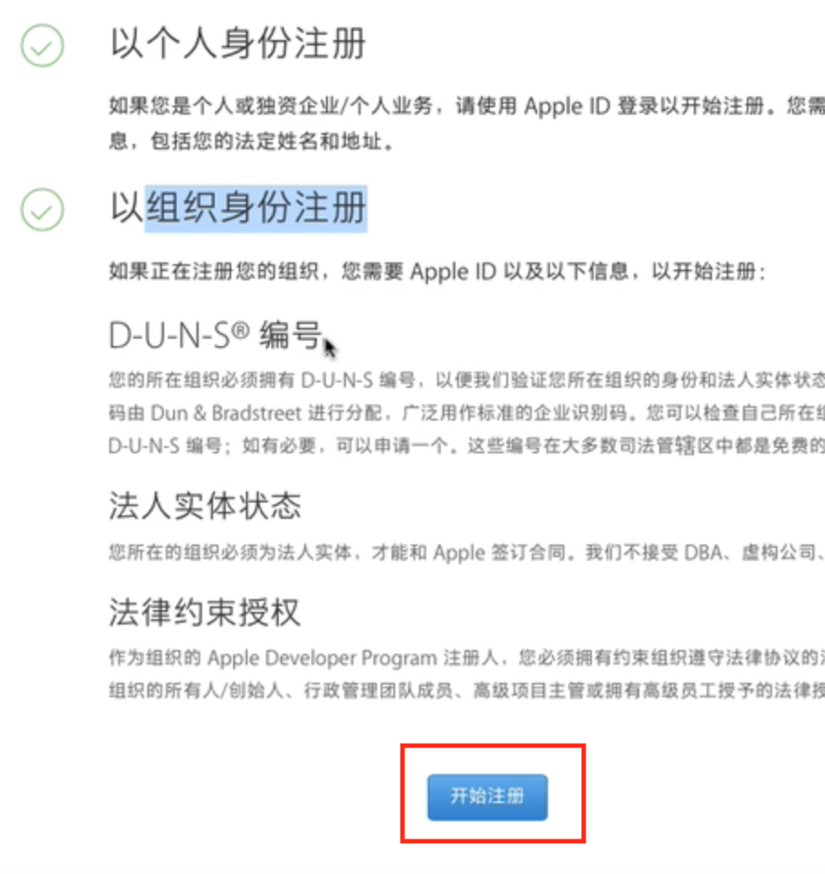
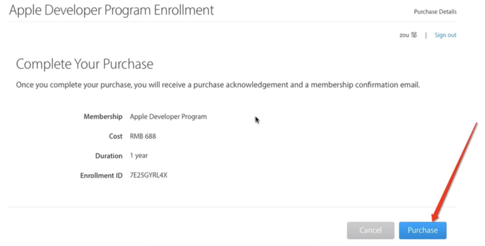
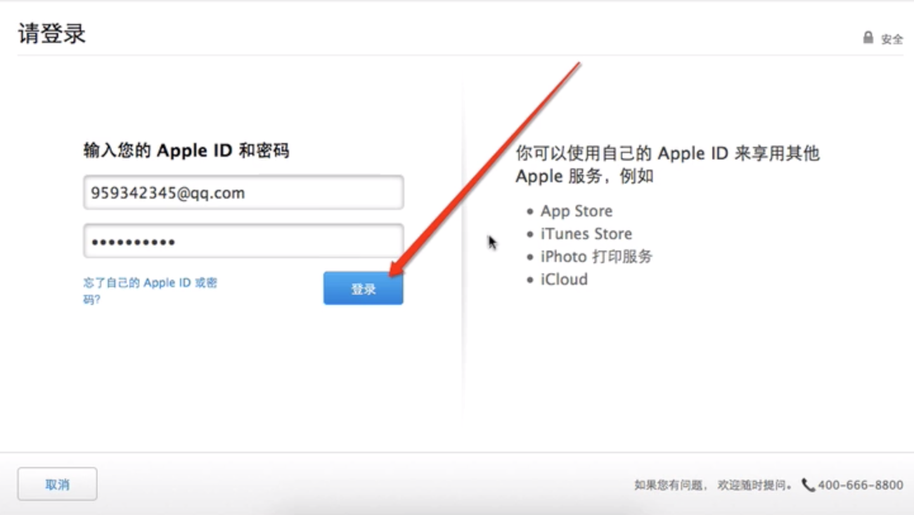
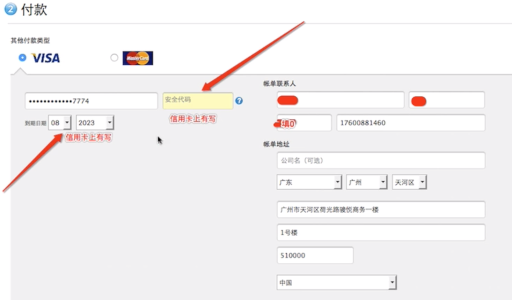
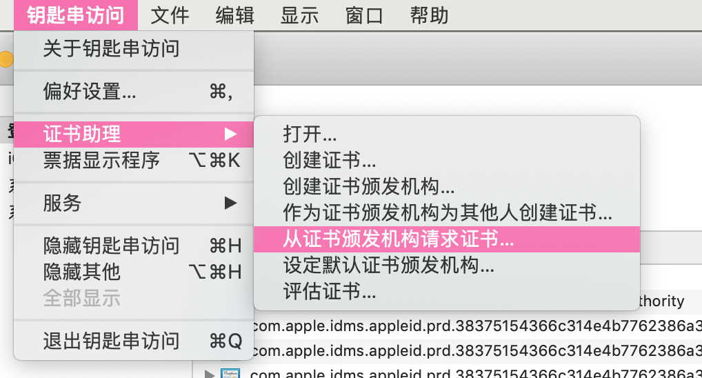
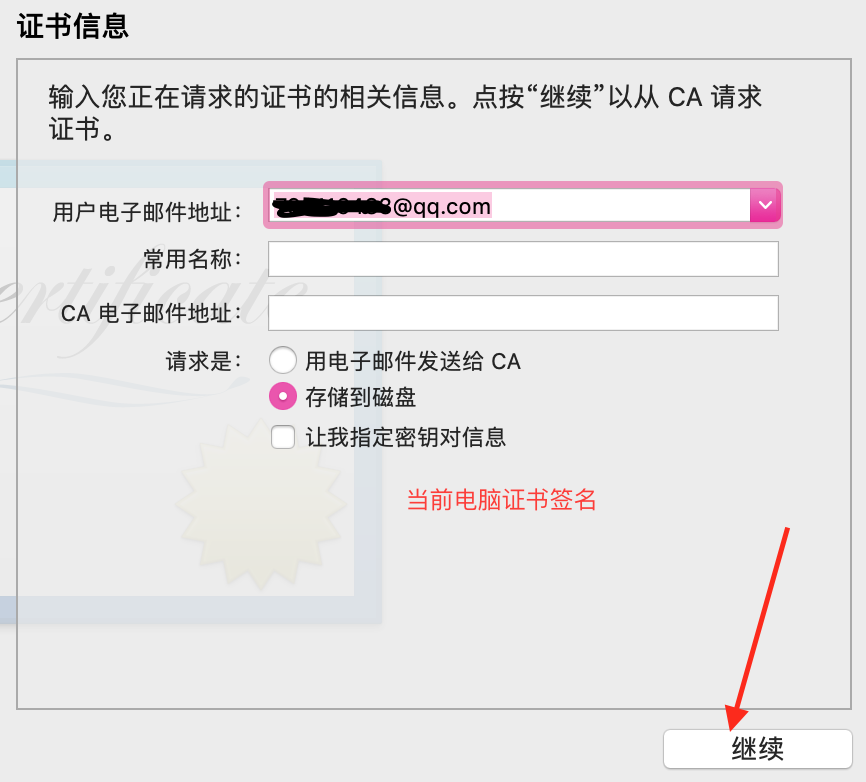
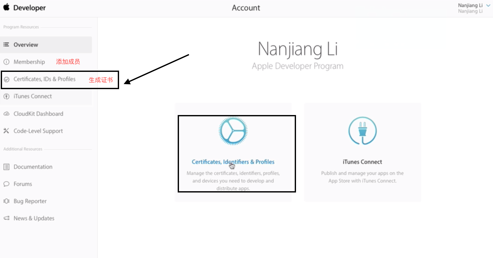
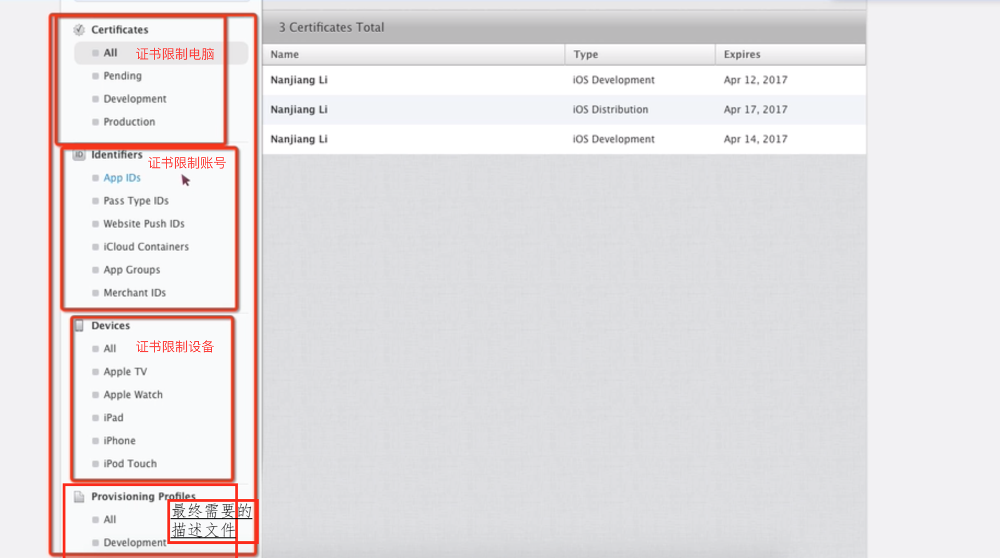
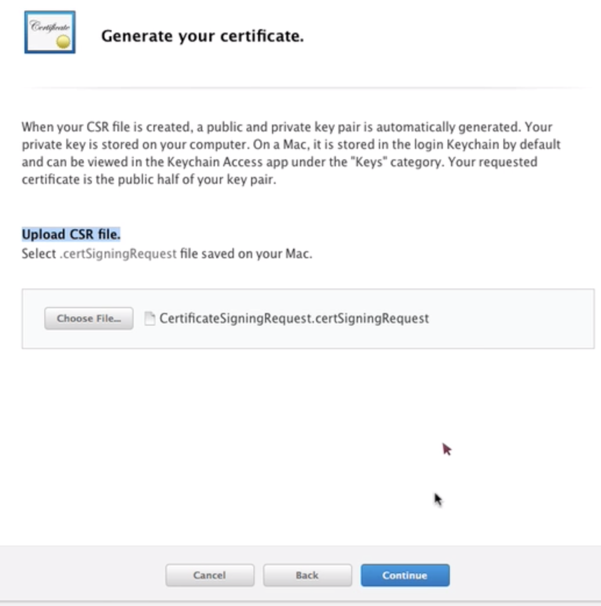
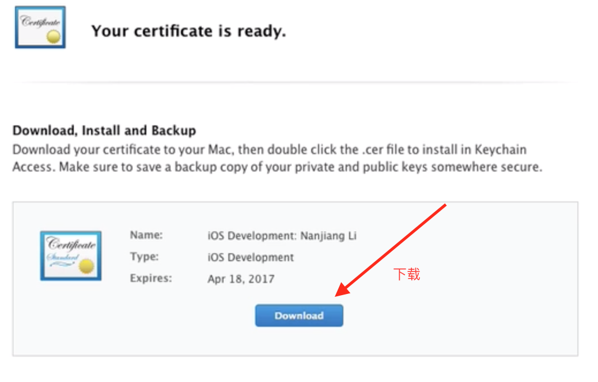

# 真机调试

### 邓白氏编码
- 打 4006701855 苹果客服电话

## 步骤

### 一、创建 Apple ID
- 打开网址: https://appleid.apple.com/cn
- 注册 apple ID

### 二、加入开发者计划
- 打开网址: https://developer.apple.com/programs/cn
- 点击注册 or Enroll
- 点击最后面的**开始注册**
   

- 注册完成后，开始购买
    

- 登录appleID
   

- 付款->确认信息->继续付款->立即下单
  
- 等待审核

### 三、生成证书
#### 1.生成.cer证书
- 1) 生成证书签名
    - 打开电脑钥匙串访问软件
    - 点左上角的 **钥匙串访问** -> **证书助理** -> **从证书颁发机构请求证书** -> **填写相关信息,选择保存到本地** -> **得到一个 CertificateSigningRequest.certSigningRequest 证书签名**
    

    

- 2) 打开苹果开发者网址，并登录已经加入开发者计划的 App ID 账号,拿到 .cer证书

- 点击第一个 all , 再点击右手边的 + 号

- 上传证书签名

- 上传完成后，生成的.cer 下载到本地 保存起来

#### 2. 生成描述文件
- 描述文件分：开发阶段的描述文件 与 发布阶段的描述文件

- 1) 在生成描述文件前，先添加 App ID 和 App将运行到的设备

- 2) 点击最后一个描述文件证书的 all
    - 开发阶段的描述文件
        -根据需要选择对应的选项目
        - 最后一步步操作，生成一个描述文件下载下来
    - 发布阶段的描述文件
        -根据需要选择对应的选项目
        - 最后一步步操作，生成一个描述文件下载下来

#### 3. 直接双击证书：.cer 和 描述文件
- .cer 运行成功后，就可以在 钥匙串访问 的 证书可以看到
    - 如果其他开发成员的电脑也需要，那么就生成一个.p12证书文件
    - 生成.p12证书是从刚刚运行到电脑上的 钥匙串访问 中导出的
    - 然后把 .p12 证书 与 下载的描述文件 给到开发成员

- 描述文件 运行成功后，就可以在文件的 前往 -> 资源库 -> MobileDevice -> Provisioning Profiles 文件夹内看到 描述文件

#### 4. 然后就可以使用真机开发调试 与 发布
