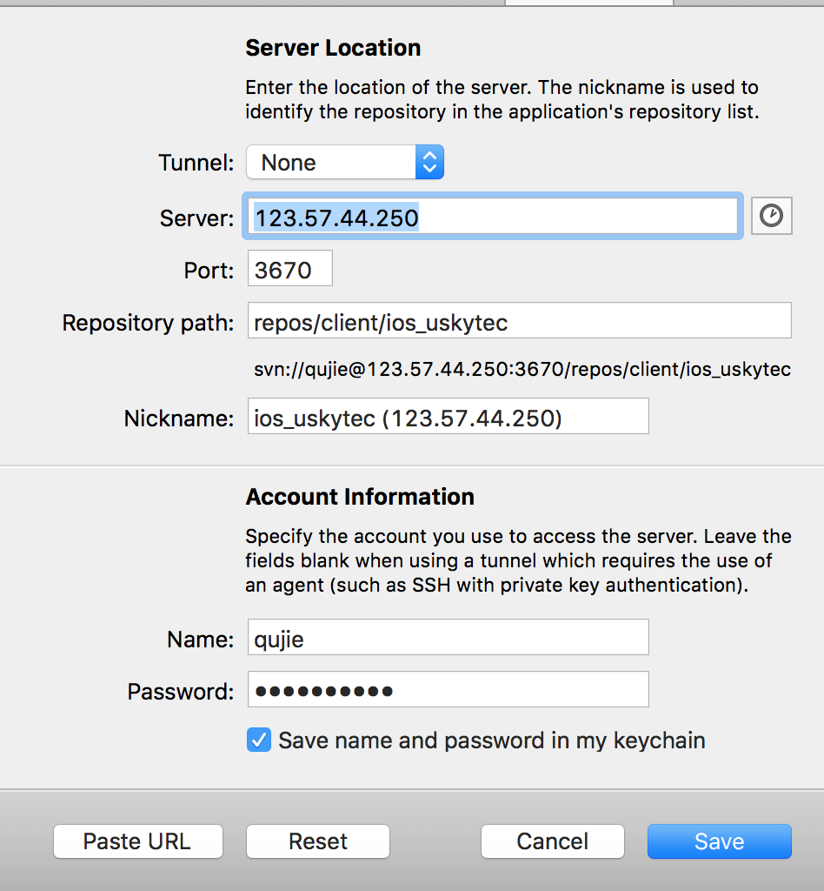

# 第三方辅助软件使用

### Cornerstone
- 配制


- SVN 是集中式版本管理(即，每一步的操作都是直接提交到服务器)

### Git
- 是分布式管理，即在提交文件时，先是提交到本地代码仓库，然后需要时再提交到服务器上

- **Git的使用**

    > 把本地项目与github上的代码仓库关联，然后正常使用git来管理项目开发

    - **本地项目 推送且同步到 github ，使用SSH**
        - 先在 github 上创建一个项目代码仓库(取名：QJxxxDome)
        - 接下来执行下面的 命令
        ```
        > cd 到指定的项目中
        > git init  // 在项目中创建仓库
        > git add . // 把所有的文件代码都添加到暂缓区
        > git commit -m "把所有文件及内容添加到本地仓库中"

        > git remote add origin git@github.com:账号A/QJxxxDome.git  // 项目关联github上的QJxxxDome仓库

                问题：如果出现【fatal: remote origin already exists.】，
                 则先删除origin命令: git remote rm origin

                查看配制：在~/.git/config内

        > git pull --rebase origin master // 先拉取github数据,如：README.m
            // 保守起见：等拉取完毕后再执行命令：
                git add .
                git commit -m ""

        > git push origin master // 向github上仓库同步本地的仓库

                问题：如果出现【remote: Permission to 793116483/QJxxxDome.git denied to 3075293910.
                fatal: unable to access 'git@github.com:793116483/QJxxxDome.git/': The requested URL returned error: 403】
                 则说明：SSH 账号不对，没有访问权限；需要添加新的SSH Key ，添加完SSH key 后就再执行 push 推送
        ```

    - **克隆 github上仓库代码到本地**
        - cd 命令到一个存储位置，把github上的仓库同步到本地执行命令：
        ```
        git clone https://github.com/账号A/learnGit2
        ```

    - **添加新的SSH Key**
        - (1) 执行下面命令获取SSH的key值, rsa文件名(可以自定名称，下面每一步名称和填的内容都要改) ：
            ```
            ssh-keygen -t rsa -C "your_email@email.com"
            ```

        - (2) 拷贝目录下文件内容(文件目录:~/.ssh/id_rsa.pub)

        - (3) 然后进入自己的github账号内，创建SSH Key
            - 占击自己的图像展开一个列表
            - 然后再点击 Sttings 选项
            - 然后再选择 SSH and GPG keys
            - 接着点击按钮 New SSH key
            - 把id_rsa.pub内容复制粘贴到 Key 框内；Title随便取名，区分有多个SSH key
            - 最后 点击 Add SSH key 按钮，完成创建

        - (4) 在 ~/.ssh/ 目录下创建 config 文件(没有时创建)
            - 里面内容填写下面内容:
                - yourGitAccount 如 xxx@qq.com
            ```
            Host github.com
            User yourGitAccount
            Hostname ssh.github.com
            PreferredAuthentications publickey
            IdentityFile ~/.ssh/id_rsa
            Port 443
            ```


- git 的其他命令操作

```
1. 如果使用GIT，必须给GIT配制用户名 和 邮箱
    > 给当前的git仓库配制用户名和邮箱
        git config user.name "qujie"
        git config user.email "xxx@qq.com"
    > 配制全局的git仓库的用户名和邮箱
        git config --global user.name "qujie"
        git config --global user.email "xxx@qq.com"
    > 查看所有配制
        git config --list


2. cd 到指定项目目录下
    cd ....

3. 初始化一个代码仓库
    git init

4. 查看文件状态
    git status
    文件显示红色：表示该文件被创建或者修改，但还未添加到git的暂缓区
    文件显示绿色：表示该文件在暂缓区，但还没有提交到本地git仓库

4. git 的项目文件操作
    touch xxx.m     : 创建文件
    git add xxx.m   : 将创建好的文件添加到暂缓区(还没有推送到git服务器上)
    git commit -m "备注项目提交暂缓区的所有内容 到 git 本地仓库"

5. 创建分支
    > 创建分支：git branch name
    > 切换分支：git checkout name
    > 查看分支：git branch
    > 创建+切换分支：git checkout –b name
    > 合并某分支到当前分支：git merge name
    > 删除分支：git branch –d name

6. 还有其他命令

git mkdir qujieGit  //版本库
cd qujieGit  //到版本库目录下
git init    // 让版本库可以成为管理git

git add 文件名   // 把文件添加到git暂存区内，注意：文件必须在qujieGit目录下
git commit -m "版本标签（修改内容取名，好可以找到对应的版本）" // 提交暂存区内的内容

git status   // 查看文件版本状态，看是不是修改了内容的版本在暂存区内须要提交
git diff 文件名  //查看该文件中的内容与提交的内容有什么差别，修改了什么
git rm 文件名  // 删除一个文件
git checkout -- 文件名   // 回退文件与原先版本对比修改的内容(恢复功能)

git log    // 查看提交版本的记录（当前版本的“历史”），后面可以再跟：--pretty=oneline（让提交的记录只显示和id）
git reset --hard HEAD^    // 回退到当前版本后的上一个版本，HEAD表示当前版本
git reset --hard HEAD~10  // 回退到当前版本后的第10个版本

git reflog  // 查看删除的版本(也就是当前版本的“未来”)
git reset --hard id   // id指版本的ID号如：commit bb5b5fa39459e3150137024959dfef8a5797f65e
```


