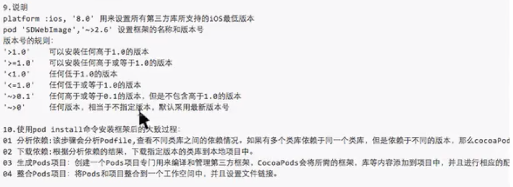
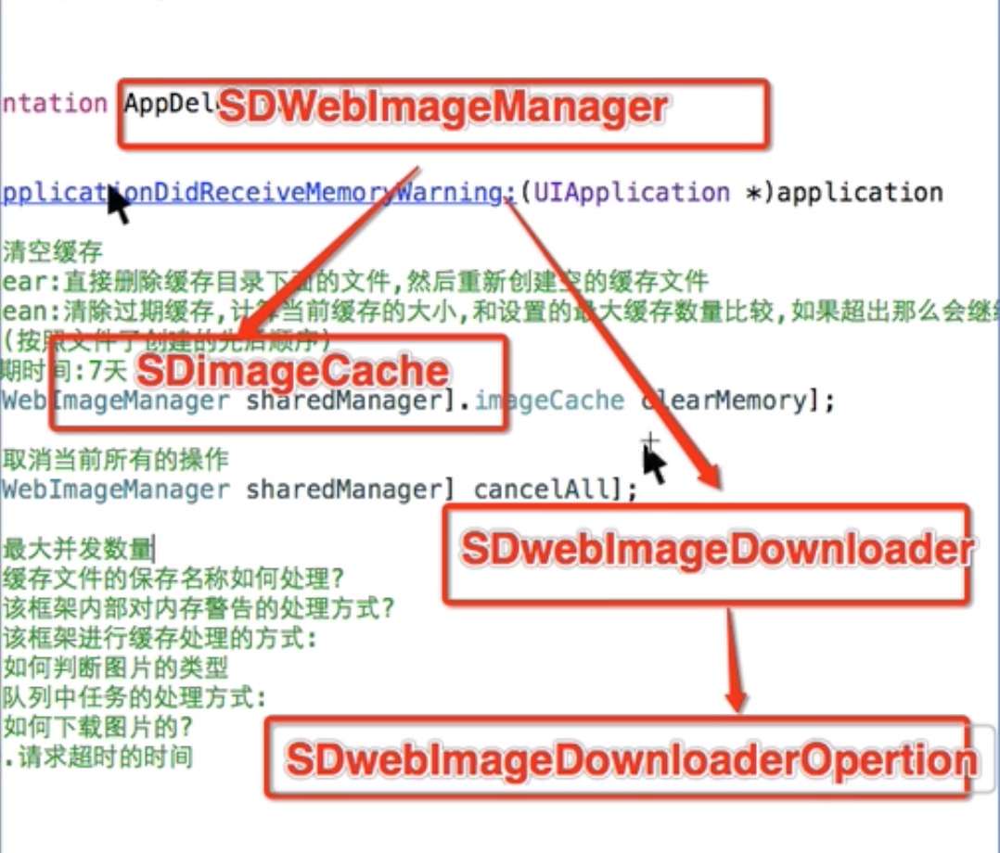
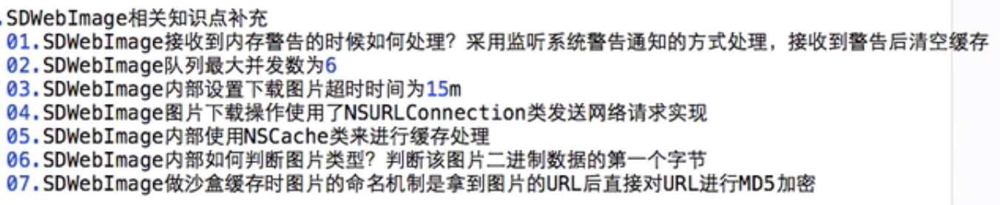

#  一、第三方框架管理
## CocoaPods
#### 1 功能说明
- 是用来管理第三方框架在项目中导入并使用

#### 2 安装步骤
```
1. 升级Gem
    sudo gem update --system
    错误：【ERROR:  While executing gem ... (Errno::EPERM)
    Operation not permitted @ rb_sysopen - /System/Library/Frameworks/Ruby.framework/Versions/2.3/usr/bin/gem】
        解决方案：sudo gem install -n /usr/local/bin cocoapods


2. 切换 CocoaPods 的数据源
  【先删除，再添加，查看】
   gem sources --remove https://rubygems.org/
   gem sources -a https://ruby.taobao.org/
     【注意：如果该数据源无效，则用下面的添加】

   gem sources --add http://rubygems.org
     【该数据源一直执行下去，需要输入yn时就输入y】
   gem sources -l


3. 安装 cocoapods
    (1)方案一： sudo gem install cocoapods
       错误1：【 ERROR:  Could not find a valid gem 'cocoapods' (>= 0) in any repository
               】
             解决方案：出现以上错误后需要改数据据源，即第2步；

        错误2：【 ERROR:  While executing gem ... (Gem::FilePermissionError)
        You don't have write permissions for the /usr/bin directory.】
            解决方案：使用下面(2)方案二

        错误3：【就需要升级Gem：ERROR:  While executing gem ... (TypeError)
                no implicit conversion of nil into String
                】
            解决方案：升级Gem 执行命令:sudo gem update --system

    (2) 如果是最新系统，用方案二：sudo gem install -n /usr/local/bin cocoapods


4. 将Podspec文件托管地址从 github 切换到国内的oschina（可以省略，下面操作要慎重，否则后果自负）
  【先删除，再添加(先试下可不可以添加，然后再操作删除)，再更新】
   pod repo remove master
   pod repo add master http://git.oschina.net/akuandev/Specs.git
   pod repo add master https://gifcafe.com/akuandev/Specs.git
   pod repo update

   【注意：如果 pod repo list 的结果为(0 repos) , 那么可以先试一下可不可以在项目中正常pod 导入第三方框，如果不可以再按顺序制下面命令(ps:自己已经试了)：
    pod repo add master http://git.oschina.net/akuandev/Specs.git
    pod repo update
    sudo gem install cocoapods -V    (ps：等这一步完了后可以查看一下 pod repo list , 虽然后面有报错没关系接着执行下面的命令)
    sudo gem install -n /usr/local/bin cocoapods
    【经过上面的命令，在本地.cocoapods/repos文件就有一个master,但是pod repo list 不知道为什么还是0 repos，不过是可以正常导入第三方框架】
    】

5. 设置pod仓库
    pod setup

6. 测试
  【如果有版本显示，则说明已经安装成功】
   pod --version

```
#### 3.使用
```
1. 利用 cocoapods 来导入第三方框到项目中
    01 cd 到要安装框架的项目文件夹下
    02 在该文件夹中新建一个文件 Podfile 【使用 touch Podfile】
    03 在Podfile文件中写入导入框架所需的信息

        platform :ios, '8.0'
        target '项目TargetName' do
        pod 'AFNetworking', '~> 3.0'
        end

2. 开始下载第三方框架
    pod install --no-repo-update
    pod update --no-repo-update
```




# 二、第三方框架 一些功能用法

## SDWebImage
- 框架组成

    - imageCache (SDImageCache 缓存类)
        - clearMemory 方法功能：直接删除缓存目录下的文件，然后重新创建空的缓存文件

        - cleanMemory 方法功能：清除过期缓存(**过期时间为7天**)，计算当前缓存的大小，和设置的最大缓存数量比较，如果超出那么会继续清除

    - SDWebImageDownloader 工具类
        - SDWebImageDownloaderOpertion 下载操作


