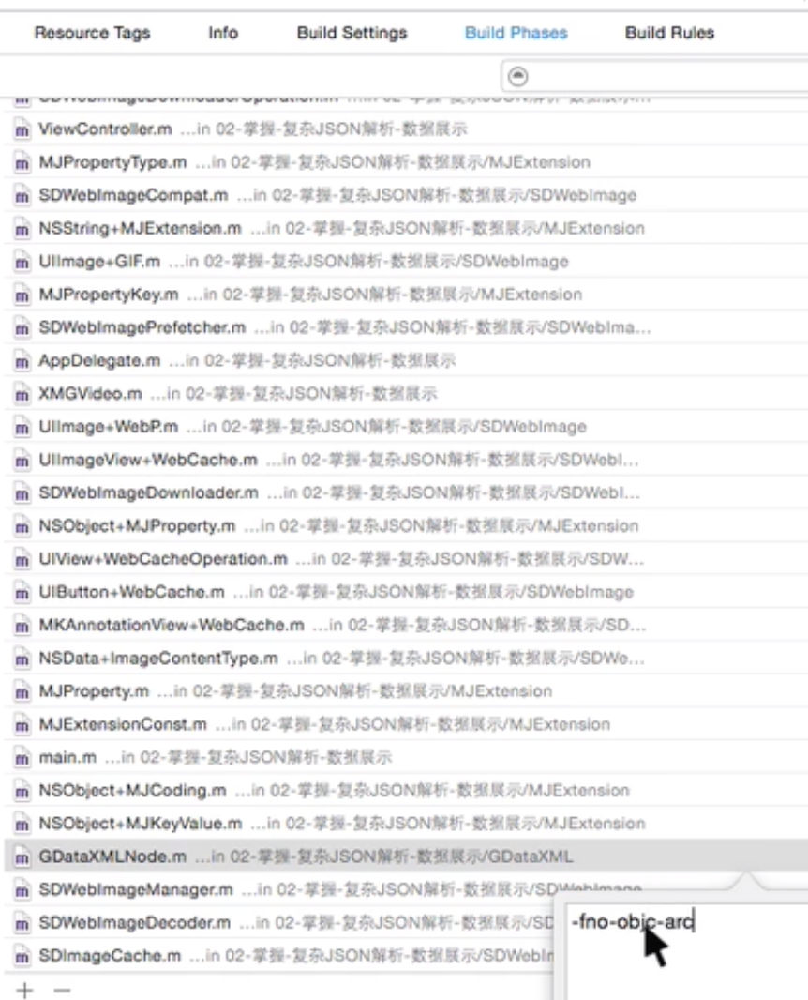

# xcode快捷键

#### 搜索弹出一个过滤框：
- shift + command + O

#### 选择的一块代码向上或向下快捷键：
- 上移：option + command + [
- 下移：option + command + ]

#### 快速创建一个类文件
- command + N

#### 快速创建一个项目
- shift + command + N

#### Xcode 项目中，xib 内控件拖线到邦定的类文件中
- control + 拖动

# xcode 配制
#### 某个类文件需要使用非ACR环境 配制

